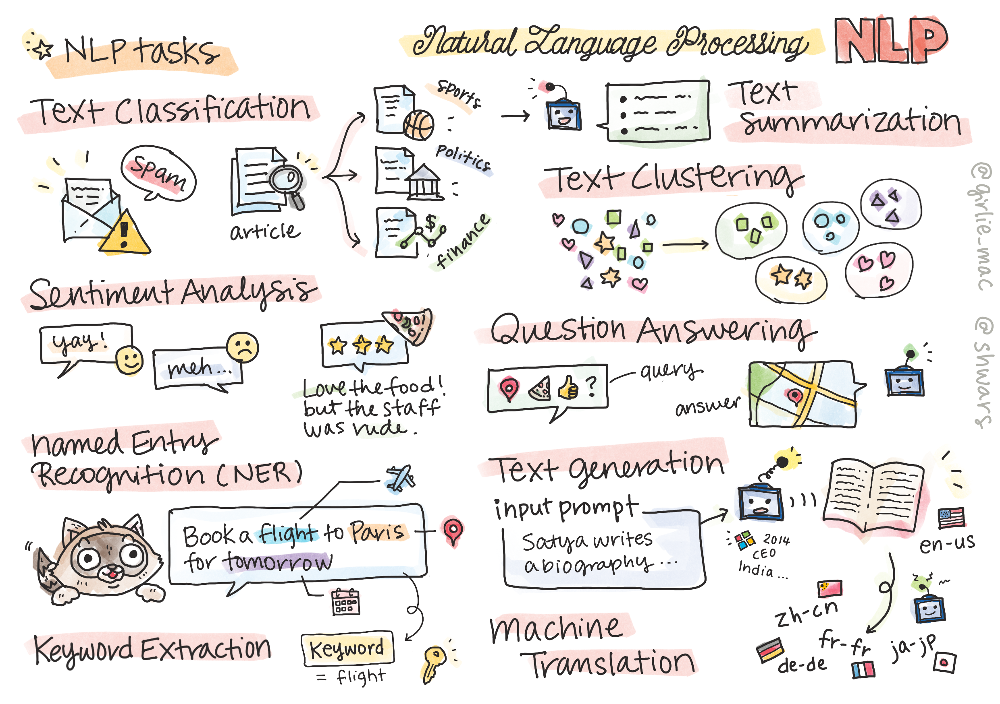

# Verarbeitung natürlicher Sprache



In diesem Abschnitt konzentrieren wir uns darauf, neuronale Netzwerke für Aufgaben im Bereich der **Verarbeitung natürlicher Sprache (NLP)** zu nutzen. Es gibt viele NLP-Probleme, die wir möchten, dass Computer lösen können:

* **Textklassifikation** ist ein typisches Klassifikationsproblem, das sich auf Textsequenzen bezieht. Beispiele sind die Klassifizierung von E-Mail-Nachrichten als Spam oder Nicht-Spam oder die Kategorisierung von Artikeln in Sport, Wirtschaft, Politik usw. Auch bei der Entwicklung von Chatbots müssen wir oft verstehen, was ein Benutzer sagen wollte – in diesem Fall beschäftigen wir uns mit **Intent-Klassifikation**. Oft müssen wir bei der Intent-Klassifikation mit vielen Kategorien umgehen.
* **Sentimentanalyse** ist ein typisches Regressionsproblem, bei dem wir einer Zahl (einem Sentiment) zuordnen müssen, wie positiv oder negativ die Bedeutung eines Satzes ist. Eine fortgeschrittenere Version der Sentimentanalyse ist die **aspektbasierte Sentimentanalyse** (ABSA), bei der wir das Sentiment nicht dem gesamten Satz, sondern verschiedenen Teilen davon (Aspekten) zuordnen, z. B. *In diesem Restaurant mochte ich die Küche, aber die Atmosphäre war schrecklich*.
* **Named Entity Recognition** (NER) bezieht sich auf das Problem, bestimmte Entitäten aus Text zu extrahieren. Zum Beispiel müssen wir möglicherweise verstehen, dass im Satz *Ich muss morgen nach Paris fliegen* das Wort *morgen* auf DATUM verweist und *Paris* ein ORT ist.
* **Schlüsselwortextraktion** ähnelt NER, aber wir müssen automatisch Wörter extrahieren, die für die Bedeutung des Satzes wichtig sind, ohne eine Vorab-Trainierung für spezifische Entitätstypen.
* **Textclustering** kann nützlich sein, wenn wir ähnliche Sätze gruppieren möchten, beispielsweise ähnliche Anfragen in technischen Supportgesprächen.
* **Fragenbeantwortung** bezieht sich auf die Fähigkeit eines Modells, eine spezifische Frage zu beantworten. Das Modell erhält einen Textabschnitt und eine Frage als Eingaben und muss einen Ort im Text angeben, an dem die Antwort auf die Frage enthalten ist (oder manchmal den Antworttext generieren).
* **Textgenerierung** ist die Fähigkeit eines Modells, neuen Text zu generieren. Sie kann als Klassifikationsaufgabe betrachtet werden, die den nächsten Buchstaben/Wort basierend auf einem *Text-Prompt* vorhersagt. Fortgeschrittene Textgenerierungsmodelle, wie GPT-3, sind in der Lage, andere NLP-Aufgaben wie Klassifikation mit einer Technik namens [Prompt-Programmierung](https://towardsdatascience.com/software-3-0-how-prompting-will-change-the-rules-of-the-game-a982fbfe1e0) oder [Prompt-Engineering](https://medium.com/swlh/openai-gpt-3-and-prompt-engineering-dcdc2c5fcd29) zu lösen.
* **Textzusammenfassung** ist eine Technik, bei der wir möchten, dass ein Computer langen Text "liest" und ihn in wenigen Sätzen zusammenfasst.
* **Maschinelle Übersetzung** kann als Kombination aus Textverständnis in einer Sprache und Textgenerierung in einer anderen angesehen werden.

Ursprünglich wurden die meisten NLP-Aufgaben mit traditionellen Methoden wie Grammatiken gelöst. Zum Beispiel wurden in der maschinellen Übersetzung Parser verwendet, um den ursprünglichen Satz in einen Syntaxbaum zu transformieren, dann wurden höhere semantische Strukturen extrahiert, um die Bedeutung des Satzes darzustellen, und basierend auf dieser Bedeutung und der Grammatik der Zielsprache wurde das Ergebnis generiert. Heutzutage werden viele NLP-Aufgaben effektiver mit neuronalen Netzwerken gelöst.

> Viele klassische NLP-Methoden sind in der Python-Bibliothek [Natural Language Processing Toolkit (NLTK)](https://www.nltk.org) implementiert. Es gibt ein großartiges [NLTK-Buch](https://www.nltk.org/book/), das online verfügbar ist und behandelt, wie verschiedene NLP-Aufgaben mit NLTK gelöst werden können.

In unserem Kurs werden wir uns hauptsächlich auf die Verwendung neuronaler Netzwerke für NLP konzentrieren und NLTK dort einsetzen, wo es notwendig ist.

Wir haben bereits gelernt, wie man neuronale Netzwerke für die Verarbeitung von tabellarischen Daten und Bildern einsetzt. Der Hauptunterschied zwischen diesen Datentypen und Text ist, dass Text eine Sequenz variabler Länge ist, während die Eingangsgröße im Fall von Bildern im Voraus bekannt ist. Während konvolutionale Netzwerke Muster aus Eingabedaten extrahieren können, sind Muster in Text komplexer. Zum Beispiel kann die Negation für viele Wörter vom Subjekt getrennt sein (z. B. *Ich mag keine Orangen* vs. *Ich mag diese großen bunten leckeren Orangen nicht*), und das sollte immer noch als ein Muster interpretiert werden. Daher müssen wir zur Handhabung von Sprache neue Arten von neuronalen Netzwerken einführen, wie *rekurrente Netzwerke* und *Transformatoren*.

## Bibliotheken installieren

Wenn Sie eine lokale Python-Installation verwenden, um diesen Kurs durchzuführen, müssen Sie möglicherweise alle erforderlichen Bibliotheken für NLP mit den folgenden Befehlen installieren:

**Für PyTorch**
```bash
pip install -r requirements-torch.txt
```
**Für TensorFlow**
```bash
pip install -r requirements-tf.txt
```

> Sie können NLP mit TensorFlow auf [Microsoft Learn](https://docs.microsoft.com/learn/modules/intro-natural-language-processing-tensorflow/?WT.mc_id=academic-77998-cacaste) ausprobieren.

## GPU-Warnung

In diesem Abschnitt werden wir in einigen Beispielen recht große Modelle trainieren.
* **Verwenden Sie einen GPU-fähigen Computer**: Es wird empfohlen, Ihre Notebooks auf einem GPU-fähigen Computer auszuführen, um die Wartezeiten beim Arbeiten mit großen Modellen zu reduzieren.
* **GPU-Speicherbeschränkungen**: Das Ausführen auf einer GPU kann zu Situationen führen, in denen der GPU-Speicher erschöpft ist, insbesondere beim Trainieren großer Modelle.
* **GPU-Speicherverbrauch**: Die Menge an GPU-Speicher, die während des Trainings verbraucht wird, hängt von verschiedenen Faktoren ab, einschließlich der Mini-Batch-Größe.
* **Mini-Batch-Größe minimieren**: Wenn Sie auf GPU-Speicherprobleme stoßen, ziehen Sie in Betracht, die Mini-Batch-Größe in Ihrem Code als potenzielle Lösung zu reduzieren.
* **TensorFlow GPU-Speicherfreigabe**: Ältere Versionen von TensorFlow geben den GPU-Speicher möglicherweise nicht korrekt frei, wenn mehrere Modelle innerhalb eines Python-Kernels trainiert werden. Um die GPU-Speichernutzung effektiv zu verwalten, können Sie TensorFlow so konfigurieren, dass GPU-Speicher nur nach Bedarf zugewiesen wird.
* **Code-Einbeziehung**: Um TensorFlow so einzustellen, dass die GPU-Speicherzuweisung nur bei Bedarf wächst, fügen Sie den folgenden Code in Ihre Notebooks ein:

```python
physical_devices = tf.config.list_physical_devices('GPU') 
if len(physical_devices)>0:
    tf.config.experimental.set_memory_growth(physical_devices[0], True) 
```

Wenn Sie daran interessiert sind, NLP aus einer klassischen ML-Perspektive zu lernen, besuchen Sie [diese Reihe von Lektionen](https://github.com/microsoft/ML-For-Beginners/tree/main/6-NLP).

## In diesem Abschnitt
In diesem Abschnitt werden wir lernen über:

* [Text als Tensoren darstellen](13-TextRep/README.md)
* [Wort-Einbettungen](14-Emdeddings/README.md)
* [Sprachmodellierung](15-LanguageModeling/README.md)
* [Rekurrente neuronale Netzwerke](16-RNN/README.md)
* [Generative Netzwerke](17-GenerativeNetworks/README.md)
* [Transformatoren](18-Transformers/README.md)

**Haftungsausschluss**:  
Dieses Dokument wurde mit maschinellen KI-Übersetzungsdiensten übersetzt. Obwohl wir uns um Genauigkeit bemühen, sollten Sie sich bewusst sein, dass automatisierte Übersetzungen Fehler oder Ungenauigkeiten enthalten können. Das Originaldokument in seiner ursprünglichen Sprache sollte als die maßgebliche Quelle betrachtet werden. Für wichtige Informationen wird eine professionelle menschliche Übersetzung empfohlen. Wir übernehmen keine Verantwortung für Missverständnisse oder Fehlinterpretationen, die aus der Verwendung dieser Übersetzung entstehen.