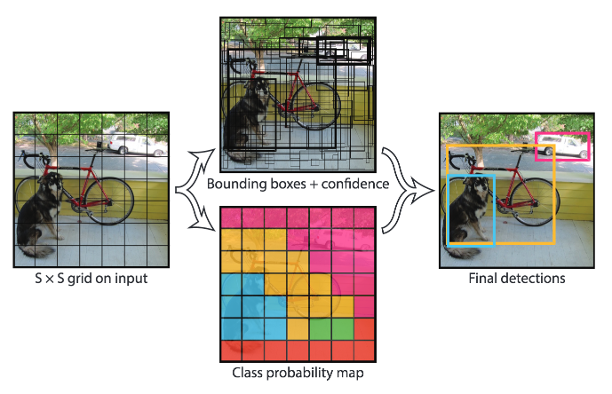

### YOLO - Solo Miras Una Vez

YOLO es un algoritmo en tiempo real de un solo pase. La idea principal es la siguiente:

* La imagen se divide en regiones de $S\times S$.
* Para cada región, **CNN** predice $n$ posibles objetos, las coordenadas del *bounding box* y *confianza* = *probabilidad* * IoU.

> Imagen del [documento oficial](https://arxiv.org/abs/1506.02640)

### Otros Algoritmos

* RetinaNet: [documento oficial](https://arxiv.org/abs/1708.02002)
   - [Implementación en PyTorch en Torchvision](https://pytorch.org/vision/stable/_modules/torchvision/models/detection/retinanet.html)
   - [Implementación en Keras](https://github.com/fizyr/keras-retinanet)
   - [Detección de Objetos con RetinaNet](https://keras.io/examples/vision/retinanet/) en Keras Samples
* SSD (Detector de Un Solo Disparo): [documento oficial](https://arxiv.org/abs/1512.02325)

## ✍️ Ejercicios: Detección de Objetos

Continúa tu aprendizaje en el siguiente cuaderno:

[ObjectDetection.ipynb](../../../../../lessons/4-ComputerVision/11-ObjectDetection/ObjectDetection.ipynb)

## Conclusión

En esta lección hiciste un recorrido rápido por las diversas maneras en que se puede llevar a cabo la detección de objetos.

## 🚀 Desafío

Lee estos artículos y cuadernos sobre YOLO y pruébalos tú mismo.

* [Buen artículo de blog](https://www.analyticsvidhya.com/blog/2018/12/practical-guide-object-detection-yolo-framewor-python/) que describe YOLO
 * [Sitio oficial](https://pjreddie.com/darknet/yolo/)
 * Yolo: [implementación en Keras](https://github.com/experiencor/keras-yolo2), [cuaderno paso a paso](https://github.com/experiencor/basic-yolo-keras/blob/master/Yolo%20Step-by-Step.ipynb)
 * Yolo v2: [implementación en Keras](https://github.com/experiencor/keras-yolo2), [cuaderno paso a paso](https://github.com/experiencor/keras-yolo2/blob/master/Yolo%20Step-by-Step.ipynb)

## [Cuestionario post-clase](https://red-field-0a6ddfd03.1.azurestaticapps.net/quiz/211)

## Revisión y Autoestudio

* [Detección de Objetos](https://tjmachinelearning.com/lectures/1718/obj/) por Nikhil Sardana
* [Una buena comparación de algoritmos de detección de objetos](https://lilianweng.github.io/lil-log/2018/12/27/object-detection-part-4.html)
* [Revisión de Algoritmos de Aprendizaje Profundo para Detección de Objetos](https://medium.com/comet-app/review-of-deep-learning-algorithms-for-object-detection-c1f3d437b852)
* [Una Introducción Paso a Paso a los Algoritmos Básicos de Detección de Objetos](https://www.analyticsvidhya.com/blog/2018/10/a-step-by-step-introduction-to-the-basic-object-detection-algorithms-part-1/)
* [Implementación de Faster R-CNN en Python para Detección de Objetos](https://www.analyticsvidhya.com/blog/2018/11/implementation-faster-r-cnn-python-object-detection/)

## [Asignación: Detección de Objetos](lab/README.md)

**Descargo de responsabilidad**:  
Este documento ha sido traducido utilizando servicios de traducción automática basados en IA. Si bien nos esforzamos por lograr precisión, tenga en cuenta que las traducciones automáticas pueden contener errores o inexactitudes. El documento original en su idioma nativo debe considerarse la fuente autorizada. Para información crítica, se recomienda una traducción profesional realizada por humanos. No nos hacemos responsables de malentendidos o malas interpretaciones que surjan del uso de esta traducción.