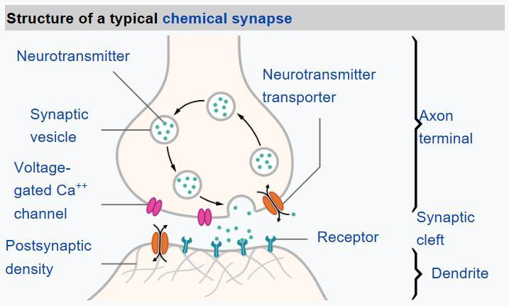

# Introduction aux Réseaux de Neurones

Comme nous l'avons discuté dans l'introduction, l'une des façons d'atteindre l'intelligence est de former un **modèle informatique** ou un **cerveau artificiel**. Depuis le milieu du 20ème siècle, les chercheurs ont essayé différents modèles mathématiques, jusqu'à ce que, ces dernières années, cette direction se révèle être extrêmement réussie. Ces modèles mathématiques du cerveau sont appelés **réseaux de neurones**.

> Parfois, les réseaux de neurones sont appelés *Réseaux de Neurones Artificiels*, RNA, afin d'indiquer que nous parlons de modèles, et non de véritables réseaux de neurones.

## Apprentissage Automatique

Les Réseaux de Neurones font partie d'une discipline plus large appelée **Apprentissage Automatique**, dont l'objectif est d'utiliser des données pour former des modèles informatiques capables de résoudre des problèmes. L'apprentissage automatique constitue une grande partie de l'intelligence artificielle, cependant, nous ne couvrons pas l'apprentissage automatique classique dans ce programme.

> Visitez notre programme séparé **[Apprentissage Automatique pour Débutants](http://github.com/microsoft/ml-for-beginners)** pour en savoir plus sur l'apprentissage automatique classique.

Dans l'apprentissage automatique, nous supposons que nous avons un ensemble de données d'exemples **X**, et des valeurs de sortie correspondantes **Y**. Les exemples sont souvent des vecteurs N-dimensionnels composés de **caractéristiques**, et les sorties sont appelées **étiquettes**.

Nous allons considérer les deux problèmes d'apprentissage automatique les plus courants :

* **Classification**, où nous devons classer un objet d'entrée en deux classes ou plus.
* **Régression**, où nous devons prédire un nombre numérique pour chacun des échantillons d'entrée.

> Lorsque nous représentons les entrées et les sorties sous forme de tenseurs, l'ensemble de données d'entrée est une matrice de taille M×N, où M est le nombre d'échantillons et N est le nombre de caractéristiques. Les étiquettes de sortie Y forment un vecteur de taille M.

Dans ce programme, nous nous concentrerons uniquement sur les modèles de réseaux de neurones.

## Un Modèle de Neurone

De la biologie, nous savons que notre cerveau est constitué de cellules nerveuses, chacune ayant plusieurs "entrées" (axones) et une sortie (dendrite). Les axones et les dendrites peuvent conduire des signaux électriques, et les connexions entre les axones et les dendrites peuvent présenter différents degrés de conductivité (contrôlés par des neuromédiateurs).

 | 
----|----
Neurone Réel *([Image](https://en.wikipedia.org/wiki/Synapse#/media/File:SynapseSchematic_lines.svg) de Wikipedia)* | Neurone Artificiel *(Image par l'Auteur)*

Ainsi, le modèle mathématique le plus simple d'un neurone contient plusieurs entrées X1, ..., XN et une sortie Y, ainsi qu'une série de poids W1, ..., WN. Une sortie est calculée comme suit :

où f est une **fonction d'activation** non linéaire.

> Les premiers modèles de neurones ont été décrits dans l'article classique [A logical calculus of the ideas immanent in nervous activity](https://www.cs.cmu.edu/~./epxing/Class/10715/reading/McCulloch.and.Pitts.pdf) par Warren McCullock et Walter Pitts en 1943. Donald Hebb, dans son livre "[The Organization of Behavior: A Neuropsychological Theory](https://books.google.com/books?id=VNetYrB8EBoC)", a proposé la manière dont ces réseaux peuvent être entraînés.

## Dans cette Section

Dans cette section, nous allons apprendre sur :
* [Perceptron](03-Perceptron/README.md), l'un des premiers modèles de réseaux de neurones pour la classification binaire
* [Réseaux multi-couches](04-OwnFramework/README.md) avec un carnet associé [comment construire notre propre framework](../../../../lessons/3-NeuralNetworks/04-OwnFramework/OwnFramework.ipynb)
* [Frameworks de Réseaux de Neurones](05-Frameworks/README.md), avec ces carnets : [PyTorch](../../../../lessons/3-NeuralNetworks/05-Frameworks/IntroPyTorch.ipynb) et [Keras/Tensorflow](../../../../lessons/3-NeuralNetworks/05-Frameworks/IntroKerasTF.ipynb)
* [Sur-apprentissage](../../../../lessons/3-NeuralNetworks/05-Frameworks)

**Avertissement** :  
Ce document a été traduit à l'aide de services de traduction automatique basés sur l'IA. Bien que nous nous efforçons d'assurer l'exactitude, veuillez noter que les traductions automatisées peuvent contenir des erreurs ou des inexactitudes. Le document original dans sa langue native doit être considéré comme la source autorisée. Pour des informations critiques, une traduction humaine professionnelle est recommandée. Nous ne sommes pas responsables des malentendus ou des erreurs d'interprétation résultant de l'utilisation de cette traduction.