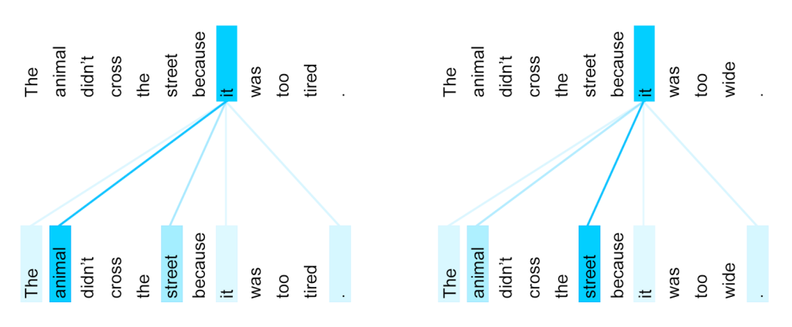
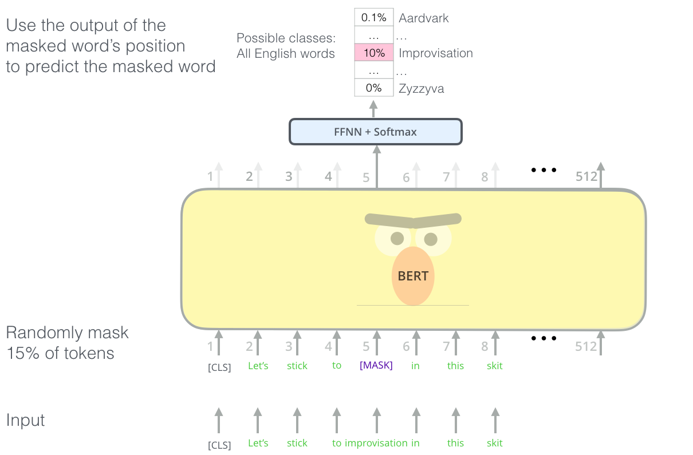

# Mécanismes d'Attention et Transformateurs

## [Quiz pré-conférence](https://red-field-0a6ddfd03.1.azurestaticapps.net/quiz/118)

L'un des problèmes les plus importants dans le domaine du NLP est la **traduction automatique**, une tâche essentielle qui sous-tend des outils tels que Google Translate. Dans cette section, nous allons nous concentrer sur la traduction automatique, ou, plus généralement, sur toute tâche de *séquence à séquence* (qui est également appelée **transduction de phrases**).

Avec les RNN, la séquence à séquence est mise en œuvre par deux réseaux récurrents, où un réseau, l'**encodeur**, réduit une séquence d'entrée à un état caché, tandis qu'un autre réseau, le **décodeur**, déroule cet état caché en un résultat traduit. Il y a quelques problèmes avec cette approche :

* L'état final du réseau encodeur a du mal à se souvenir du début d'une phrase, ce qui entraîne une mauvaise qualité du modèle pour les longues phrases.
* Tous les mots d'une séquence ont le même impact sur le résultat. En réalité, cependant, certains mots spécifiques de la séquence d'entrée ont souvent plus d'impact sur les sorties séquentielles que d'autres.

Les **Mécanismes d'Attention** fournissent un moyen de pondérer l'impact contextuel de chaque vecteur d'entrée sur chaque prédiction de sortie du RNN. La manière dont cela est mis en œuvre consiste à créer des raccourcis entre les états intermédiaires du RNN d'entrée et le RNN de sortie. De cette manière, lors de la génération du symbole de sortie yt, nous prendrons en compte tous les états cachés d'entrée hi, avec des coefficients de poids différents αt,i.

> Le modèle encodeur-décodeur avec mécanisme d'attention additive dans [Bahdanau et al., 2015](https://arxiv.org/pdf/1409.0473.pdf), cité dans [cet article de blog](https://lilianweng.github.io/lil-log/2018/06/24/attention-attention.html)

La matrice d'attention {αi,j} représenterait le degré auquel certains mots d'entrée jouent dans la génération d'un mot donné dans la séquence de sortie. Voici un exemple d'une telle matrice :

> Figure de [Bahdanau et al., 2015](https://arxiv.org/pdf/1409.0473.pdf) (Fig.3)

Les mécanismes d'attention sont responsables de beaucoup de l'état actuel ou presque actuel de l'art dans le NLP. Cependant, l'ajout d'attention augmente considérablement le nombre de paramètres du modèle, ce qui a conduit à des problèmes d'échelle avec les RNN. Une contrainte clé de l'échelle des RNN est que la nature récurrente des modèles rend difficile le traitement par lots et la parallélisation de l'entraînement. Dans un RNN, chaque élément d'une séquence doit être traité dans l'ordre séquentiel, ce qui signifie qu'il ne peut pas être facilement parallélisé.

> Figure de [Blog de Google](https://research.googleblog.com/2016/09/a-neural-network-for-machine.html)

L'adoption des mécanismes d'attention combinée à cette contrainte a conduit à la création des modèles de transformateurs qui sont maintenant à la pointe de la technologie que nous connaissons et utilisons aujourd'hui, tels que BERT et Open-GPT3.

## Modèles de Transformateurs

L'une des principales idées derrière les transformateurs est d'éviter la nature séquentielle des RNN et de créer un modèle qui est parallélisable pendant l'entraînement. Cela est réalisé en mettant en œuvre deux idées :

* codage positionnel
* utilisation du mécanisme d'auto-attention pour capturer des motifs au lieu des RNN (ou CNN) (c'est pourquoi l'article qui introduit les transformateurs s'appelle *[Attention is all you need](https://arxiv.org/abs/1706.03762)*)

### Codage/Emballage Positionnel

L'idée du codage positionnel est la suivante. 
1. Lors de l'utilisation des RNN, la position relative des jetons est représentée par le nombre d'étapes, et n'a donc pas besoin d'être représentée explicitement. 
2. Cependant, une fois que nous passons à l'attention, nous devons connaître les positions relatives des jetons dans une séquence. 
3. Pour obtenir le codage positionnel, nous augmentons notre séquence de jetons avec une séquence de positions de jetons dans la séquence (c'est-à-dire, une séquence de nombres 0,1, ...).
4. Nous mélangeons ensuite la position du jeton avec un vecteur d'embedding de jeton. Pour transformer la position (entier) en un vecteur, nous pouvons utiliser différentes approches :

* Embedding entraînable, similaire à l'embedding de jeton. C'est l'approche que nous considérons ici. Nous appliquons des couches d'embedding sur les jetons et leurs positions, ce qui donne des vecteurs d'embedding de mêmes dimensions, que nous additionnons ensuite.
* Fonction de codage de position fixe, comme proposé dans l'article original.

> Image de l'auteur

Le résultat que nous obtenons avec l'embedding positionnel intègre à la fois le jeton original et sa position dans une séquence.

### Auto-Attention Multi-Tête

Ensuite, nous devons capturer certains motifs au sein de notre séquence. Pour ce faire, les transformateurs utilisent un mécanisme d'**auto-attention**, qui est essentiellement une attention appliquée à la même séquence en tant qu'entrée et sortie. L'application de l'auto-attention nous permet de prendre en compte le **contexte** au sein de la phrase, et de voir quels mots sont inter-reliés. Par exemple, cela nous permet de voir quels mots sont référencés par des coréférences, telles que *il*, et également de prendre en compte le contexte :

> Image du [Blog de Google](https://research.googleblog.com/2017/08/transformer-novel-neural-network.html)

Dans les transformateurs, nous utilisons l'**Attention Multi-Tête** afin de donner au réseau la capacité de capturer plusieurs types de dépendances différentes, par exemple les relations entre mots à long terme par rapport à celles à court terme, les co-références par rapport à autre chose, etc.

[Notebook TensorFlow](../../../../../lessons/5-NLP/18-Transformers/TransformersTF.ipynb) contient plus de détails sur l'implémentation des couches de transformateurs.

### Attention Encodeur-Décodeur

Dans les transformateurs, l'attention est utilisée à deux endroits :

* Pour capturer des motifs au sein du texte d'entrée en utilisant l'auto-attention
* Pour effectuer la traduction de séquence - c'est la couche d'attention entre l'encodeur et le décodeur.

L'attention encodeur-décodeur est très similaire au mécanisme d'attention utilisé dans les RNN, comme décrit au début de cette section. Ce diagramme animé explique le rôle de l'attention encodeur-décodeur.

Puisque chaque position d'entrée est mappée indépendamment à chaque position de sortie, les transformateurs peuvent mieux se paralléliser que les RNN, ce qui permet des modèles de langage beaucoup plus grands et plus expressifs. Chaque tête d'attention peut être utilisée pour apprendre différentes relations entre les mots, ce qui améliore les tâches de traitement du langage naturel en aval.

## BERT

**BERT** (Représentations Encodeur Bidirectionnelles à partir de Transformateurs) est un très grand réseau de transformateurs multicouches avec 12 couches pour *BERT-base*, et 24 pour *BERT-large*. Le modèle est d'abord pré-entraîné sur un grand corpus de données textuelles (WikiPedia + livres) en utilisant un entraînement non supervisé (prédiction de mots masqués dans une phrase). Pendant le pré-entraînement, le modèle absorbe des niveaux significatifs de compréhension linguistique qui peuvent ensuite être exploités avec d'autres ensembles de données en utilisant un ajustement fin. Ce processus est appelé **apprentissage par transfert**.

> Image [source](http://jalammar.github.io/illustrated-bert/)

## ✍️ Exercices : Transformateurs

Poursuivez votre apprentissage dans les notebooks suivants :

* [Transformateurs en PyTorch](../../../../../lessons/5-NLP/18-Transformers/TransformersPyTorch.ipynb)
* [Transformateurs en TensorFlow](../../../../../lessons/5-NLP/18-Transformers/TransformersTF.ipynb)

## Conclusion

Dans cette leçon, vous avez appris sur les Transformateurs et les Mécanismes d'Attention, tous des outils essentiels dans la boîte à outils du NLP. Il existe de nombreuses variations d'architectures de Transformateurs, y compris BERT, DistilBERT, BigBird, OpenGPT3 et plus encore, qui peuvent être ajustées. Le [package HuggingFace](https://github.com/huggingface/) fournit un dépôt pour entraîner bon nombre de ces architectures avec PyTorch et TensorFlow.

## 🚀 Défi

## [Quiz post-conférence](https://red-field-0a6ddfd03.1.azurestaticapps.net/quiz/218)

## Revue & Auto-étude

* [Article de blog](https://mchromiak.github.io/articles/2017/Sep/12/Transformer-Attention-is-all-you-need/), expliquant l'article classique [Attention is all you need](https://arxiv.org/abs/1706.03762) sur les transformateurs.
* [Une série d'articles de blog](https://towardsdatascience.com/transformers-explained-visually-part-1-overview-of-functionality-95a6dd460452) sur les transformateurs, expliquant l'architecture en détail.

## [Devoir](assignment.md)

**Avertissement** :  
Ce document a été traduit à l'aide de services de traduction automatique basés sur l'IA. Bien que nous nous efforçons d'assurer l'exactitude, veuillez noter que les traductions automatiques peuvent contenir des erreurs ou des inexactitudes. Le document original dans sa langue native doit être considéré comme la source autoritaire. Pour des informations critiques, une traduction professionnelle par un humain est recommandée. Nous ne sommes pas responsables des malentendus ou des interprétations erronées résultant de l'utilisation de cette traduction.