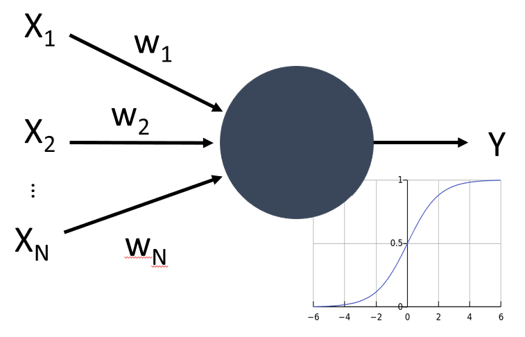

# न्यूरल नेटवर्क का परिचय

जैसा कि हमने परिचय में चर्चा की, बुद्धिमत्ता प्राप्त करने के तरीकों में से एक है **कंप्यूटर मॉडल** या **कृत्रिम मस्तिष्क** को प्रशिक्षित करना। 20वीं सदी के मध्य से, शोधकर्ताओं ने विभिन्न गणितीय मॉडलों का प्रयास किया, जब तक कि हाल के वर्षों में यह दिशा अत्यधिक सफल साबित नहीं हुई। मस्तिष्क के ऐसे गणितीय मॉडल को **न्यूरल नेटवर्क** कहा जाता है।

> कभी-कभी न्यूरल नेटवर्क को *कृत्रिम न्यूरल नेटवर्क* (Artificial Neural Networks), ANNs कहा जाता है, ताकि यह संकेत मिल सके कि हम मॉडल के बारे में बात कर रहे हैं, न कि न्यूरॉन्स के वास्तविक नेटवर्क के बारे में।

## मशीन लर्निंग

न्यूरल नेटवर्क एक बड़े क्षेत्र का हिस्सा हैं जिसे **मशीन लर्निंग** कहा जाता है, जिसका लक्ष्य डेटा का उपयोग करके कंप्यूटर मॉडल को प्रशिक्षित करना है जो समस्याओं को हल कर सकें। मशीन लर्निंग कृत्रिम बुद्धिमत्ता का एक बड़ा हिस्सा बनाता है, हालांकि, हम इस पाठ्यक्रम में पारंपरिक मशीन लर्निंग को कवर नहीं करते हैं।

> अधिक जानकारी के लिए हमारे अलग **[मशीन लर्निंग फॉर बिगिनर्स](http://github.com/microsoft/ml-for-beginners)** पाठ्यक्रम पर जाएं।

मशीन लर्निंग में, हम मानते हैं कि हमारे पास कुछ उदाहरणों का डेटासेट **X** है, और संबंधित आउटपुट मान **Y** हैं। उदाहरण अक्सर N-आयामी वेक्टर होते हैं जो **विशेषताओं** से बने होते हैं, और आउटपुट को **लेबल** कहा जाता है।

हम मशीन लर्निंग की दो सबसे सामान्य समस्याओं पर विचार करेंगे:

* **वर्गीकरण**, जहां हमें एक इनपुट वस्तु को दो या अधिक वर्गों में वर्गीकृत करना होता है।
* **प्रतिगमन**, जहां हमें प्रत्येक इनपुट नमूने के लिए एक संख्यात्मक संख्या की भविष्यवाणी करनी होती है।

> जब इनपुट और आउटपुट को टेन्सर के रूप में दर्शाया जाता है, तो इनपुट डेटासेट M×N आकार के मैट्रिक्स होता है, जहां M नमूनों की संख्या है और N विशेषताओं की संख्या है। आउटपुट लेबल Y M आकार का वेक्टर होता है।

इस पाठ्यक्रम में, हम केवल न्यूरल नेटवर्क मॉडल पर ध्यान केंद्रित करेंगे।

## न्यूरॉन का मॉडल

जीवविज्ञान से हमें पता है कि हमारा मस्तिष्क न्यूरल कोशिकाओं से बना है, जिनमें से प्रत्येक के पास कई "इनपुट" (एक्सन) और एक आउटपुट (डेंड्राइट) होता है। एक्सन और डेंड्राइट विद्युत संकेतों का संचरण कर सकते हैं, और एक्सन और डेंड्राइट के बीच के संबंध विभिन्न स्तरों की चालकता प्रदर्शित कर सकते हैं (जो न्यूरोमेडिएटर्स द्वारा नियंत्रित होते हैं)।

 | 
----|----
वास्तविक न्यूरॉन *([छवि](https://en.wikipedia.org/wiki/Synapse#/media/File:SynapseSchematic_lines.svg) विकिपीडिया से)* | कृत्रिम न्यूरॉन *(लेखक द्वारा छवि)*

इस प्रकार, न्यूरॉन का सबसे सरल गणितीय मॉडल कई इनपुट X1, ..., XN और एक आउटपुट Y, और W1, ..., WN का एक सेट होता है। एक आउटपुट इस प्रकार गणना की जाती है:

जहां f कुछ गैर-रेखीय **सक्रियण फ़ंक्शन** है।

> न्यूरॉन के प्रारंभिक मॉडलों का वर्णन क्लासिकल पेपर [A logical calculus of the ideas immanent in nervous activity](https://www.cs.cmu.edu/~./epxing/Class/10715/reading/McCulloch.and.Pitts.pdf) में वॉरेन मैककुलोक और वॉल्टर पिट्स द्वारा 1943 में किया गया था। डोनाल्ड हेब्ब ने अपनी पुस्तक "[The Organization of Behavior: A Neuropsychological Theory](https://books.google.com/books?id=VNetYrB8EBoC)" में प्रस्तावित किया कि उन नेटवर्क को कैसे प्रशिक्षित किया जा सकता है।

## इस अनुभाग में

इस अनुभाग में हम निम्नलिखित के बारे में सीखेंगे:
* [परसेप्ट्रोन](03-Perceptron/README.md), दो-क्लास वर्गीकरण के लिए सबसे प्रारंभिक न्यूरल नेटवर्क मॉडल में से एक
* [मल्टी-लेयर्ड नेटवर्क](04-OwnFramework/README.md) के साथ एक संबंधित नोटबुक [हमारा अपना ढांचा कैसे बनाएं](../../../../lessons/3-NeuralNetworks/04-OwnFramework/OwnFramework.ipynb)
* [न्यूरल नेटवर्क ढांचे](05-Frameworks/README.md), इन नोटबुक के साथ: [PyTorch](../../../../lessons/3-NeuralNetworks/05-Frameworks/IntroPyTorch.ipynb) और [Keras/Tensorflow](../../../../lessons/3-NeuralNetworks/05-Frameworks/IntroKerasTF.ipynb)
* [ओवरफिटिंग](../../../../lessons/3-NeuralNetworks/05-Frameworks)

**अस्वीकृति**:  
यह दस्तावेज़ मशीन-आधारित एआई अनुवाद सेवाओं का उपयोग करके अनुवादित किया गया है। जबकि हम सटीकता के लिए प्रयासरत हैं, कृपया ध्यान रखें कि स्वचालित अनुवाद में त्रुटियाँ या असमानताएँ हो सकती हैं। मूल दस्तावेज़ को उसकी मूल भाषा में प्राधिकृत स्रोत माना जाना चाहिए। महत्वपूर्ण जानकारी के लिए, पेशेवर मानव अनुवाद की सिफारिश की जाती है। इस अनुवाद के उपयोग से उत्पन्न किसी भी गलतफहमी या गलत व्याख्या के लिए हम जिम्मेदार नहीं हैं।