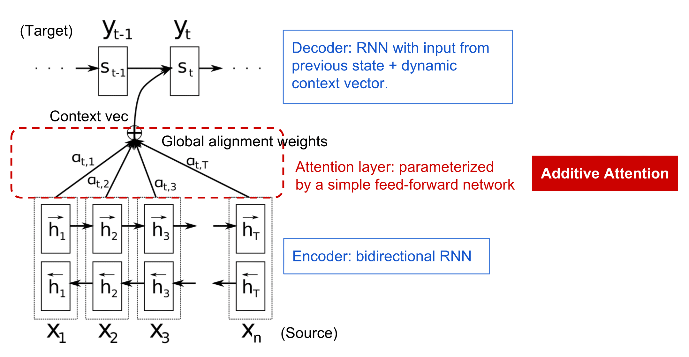
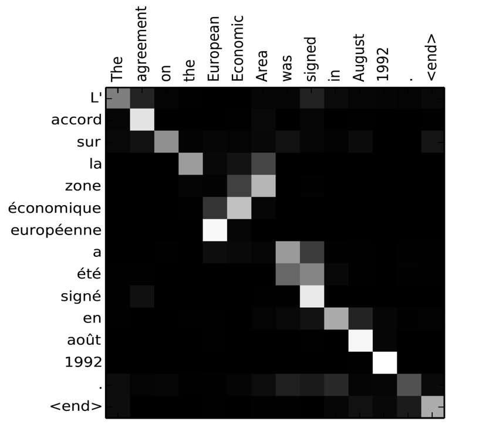
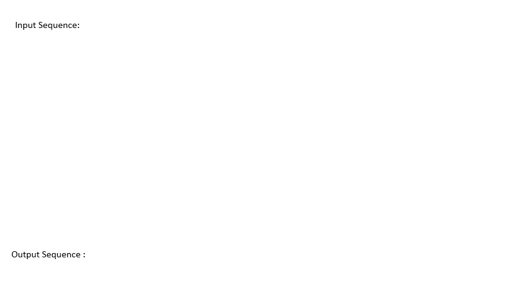

# ध्यान तंत्र और ट्रांसफार्मर

## [प्री-लेचर क्विज़](https://red-field-0a6ddfd03.1.azurestaticapps.net/quiz/118)

NLP क्षेत्र में सबसे महत्वपूर्ण समस्याओं में से एक है **मशीन अनुवाद**, जो ऐसे उपकरणों के लिए एक आवश्यक कार्य है जैसे कि Google Translate। इस अनुभाग में, हम मशीन अनुवाद पर ध्यान केंद्रित करेंगे, या, सामान्य रूप से, किसी भी *क्रम-से-क्रम* कार्य पर (जिसे **वाक्य ट्रांसडक्सन** भी कहा जाता है)।

RNNs के साथ, क्रम-से-क्रम को दो आवर्ती नेटवर्क द्वारा लागू किया जाता है, जहां एक नेटवर्क, **एन्कोडर**, एक इनपुट अनुक्रम को एक छिपी हुई स्थिति में संकुचित करता है, जबकि दूसरा नेटवर्क, **डिकोडर**, इस छिपी हुई स्थिति को एक अनुवादित परिणाम में अनरोल करता है। इस दृष्टिकोण के साथ कुछ समस्याएं हैं:

* एन्कोडर नेटवर्क की अंतिम स्थिति एक वाक्य की शुरुआत को याद रखने में कठिनाई महसूस करती है, जिससे लंबे वाक्यों के लिए मॉडल की गुणवत्ता खराब होती है।
* अनुक्रम में सभी शब्दों का परिणाम पर समान प्रभाव होता है। हालांकि, वास्तविकता में, इनपुट अनुक्रम में विशिष्ट शब्द अक्सर अन्य की तुलना में अनुक्रमिक आउटपुट पर अधिक प्रभाव डालते हैं।

**ध्यान तंत्र** प्रत्येक इनपुट वेक्टर के संदर्भात्मक प्रभाव को RNN के प्रत्येक आउटपुट भविष्यवाणी पर वजन देने का एक साधन प्रदान करते हैं। इसे लागू करने का तरीका इनपुट RNN और आउटपुट RNN के मध्यवर्ती राज्यों के बीच शॉर्टकट बनाना है। इस तरह, जब आउटपुट प्रतीक yt उत्पन्न करते हैं, तो हम सभी इनपुट छिपी हुई स्थितियों hi को विभिन्न वजन गुणांक αt,i के साथ ध्यान में रखते हैं।

> एन्कोडर-डिकोडर मॉडल जिसमें जोड़ात्मक ध्यान तंत्र है [Bahdanau et al., 2015](https://arxiv.org/pdf/1409.0473.pdf) से, [इस ब्लॉग पोस्ट](https://lilianweng.github.io/lil-log/2018/06/24/attention-attention.html) से उद्धृत।

ध्यान मैट्रिक्स {αi,j} यह दर्शाएगा कि कुछ इनपुट शब्दों का एक दिए गए शब्द के उत्पादन में क्या योगदान है। नीचे एक ऐसे मैट्रिक्स का उदाहरण दिया गया है:

> चित्र [Bahdanau et al., 2015](https://arxiv.org/pdf/1409.0473.pdf) से (चित्र 3)

ध्यान तंत्र वर्तमान या लगभग वर्तमान राज्य में NLP में महत्वपूर्ण भूमिका निभाते हैं। हालांकि, ध्यान जोड़ने से मॉडल के पैरामीटर की संख्या बहुत बढ़ जाती है, जिससे RNNs के साथ स्केलिंग की समस्याएं उत्पन्न होती हैं। RNNs के स्केलिंग का एक प्रमुख बाधा यह है कि मॉडलों की आवर्ती प्रकृति प्रशिक्षण को बैच और समानांतर बनाना चुनौतीपूर्ण बनाती है। एक RNN में अनुक्रम के प्रत्येक तत्व को अनुक्रमिक क्रम में संसाधित करने की आवश्यकता होती है, जिसका अर्थ है कि इसे आसानी से समानांतर नहीं किया जा सकता है।

> चित्र [Google के ब्लॉग](https://research.googleblog.com/2016/09/a-neural-network-for-machine.html) से

ध्यान तंत्रों को अपनाने और इस बाधा के संयोजन ने आज के ज्ञात और उपयोग किए जाने वाले स्टेट ऑफ द आर्ट ट्रांसफार्मर मॉडल्स जैसे BERT से Open-GPT3 के निर्माण की ओर अग्रसर किया।

## ट्रांसफार्मर मॉडल

ट्रांसफार्मरों के पीछे का एक मुख्य विचार RNNs की अनुक्रमिक प्रकृति से बचना और एक ऐसा मॉडल बनाना है जो प्रशिक्षण के दौरान समानांतर हो सके। यह दो विचारों को लागू करके प्राप्त किया जाता है:

* स्थिति एन्कोडिंग
* पैटर्न कैप्चर करने के लिए आत्म-ध्यान तंत्र का उपयोग करना, RNNs (या CNNs) के बजाय (यही कारण है कि ट्रांसफार्मर को पेश करने वाला पेपर *[ध्यान ही सब कुछ है](https://arxiv.org/abs/1706.03762)* कहा जाता है)

### स्थिति एन्कोडिंग/एंबेडिंग

स्थिति एन्कोडिंग का विचार निम्नलिखित है।
1. RNNs का उपयोग करते समय, टोकनों की सापेक्ष स्थिति चरणों की संख्या द्वारा दर्शाई जाती है, और इसलिए इसे स्पष्ट रूप से दर्शाने की आवश्यकता नहीं है।
2. हालाँकि, जब हम ध्यान में स्विच करते हैं, तो हमें अनुक्रम में टोकनों की सापेक्ष स्थितियों को जानने की आवश्यकता होती है।
3. स्थिति एन्कोडिंग प्राप्त करने के लिए, हम अपने टोकनों के अनुक्रम को अनुक्रम में टोकन स्थितियों के अनुक्रम के साथ बढ़ाते हैं (यानी, 0, 1, ... की संख्या का अनुक्रम)।
4. फिर हम टोकन स्थिति को टोकन एंबेडिंग वेक्टर के साथ मिलाते हैं। स्थिति (पूर्णांक) को वेक्टर में परिवर्तित करने के लिए, हम विभिन्न दृष्टिकोणों का उपयोग कर सकते हैं:

* प्रशिक्षनीय एंबेडिंग, जो टोकन एंबेडिंग के समान है। यही दृष्टिकोण हम यहाँ मानते हैं। हम टोकनों और उनके स्थितियों पर एंबेडिंग परतें लागू करते हैं, जिससे समान आयामों के एंबेडिंग वेक्टर प्राप्त होते हैं, जिन्हें हम फिर जोड़ते हैं।
* निश्चित स्थिति एन्कोडिंग फ़ंक्शन, जैसा कि मूल पेपर में प्रस्तावित किया गया है।

> चित्र लेखक द्वारा

जिस परिणाम को हम स्थिति एंबेडिंग के साथ प्राप्त करते हैं वह अनुक्रम में मूल टोकन और इसकी स्थिति दोनों को एंबेड करता है।

### मल्टी-हेड आत्म-ध्यान

अगला, हमें अपने अनुक्रम में कुछ पैटर्न कैप्चर करने की आवश्यकता है। ऐसा करने के लिए, ट्रांसफार्मर **आत्म-ध्यान** तंत्र का उपयोग करते हैं, जो मूल रूप से इनपुट और आउटपुट के रूप में उसी अनुक्रम पर लागू ध्यान है। आत्म-ध्यान लागू करने से हमें वाक्य के भीतर **संदर्भ** को ध्यान में रखने की अनुमति मिलती है, और यह देखने की अनुमति मिलती है कि कौन से शब्द आपस में संबंधित हैं। उदाहरण के लिए, यह हमें यह देखने की अनुमति देता है कि कौन से शब्द सहसंबंधों द्वारा संदर्भित हैं, जैसे *यह*, और संदर्भ को भी ध्यान में रखते हैं:

> चित्र [Google ब्लॉग](https://research.googleblog.com/2017/08/transformer-novel-neural-network.html) से

ट्रांसफार्मर में, हम **मल्टी-हेड ध्यान** का उपयोग करते हैं ताकि नेटवर्क को विभिन्न प्रकार की निर्भरताओं को कैप्चर करने की शक्ति दी जा सके, जैसे कि दीर्घकालिक बनाम तात्कालिक शब्द संबंध, सह-संदर्भ बनाम कुछ और, आदि।

[TensorFlow नोटबुक](../../../../../lessons/5-NLP/18-Transformers/TransformersTF.ipynb) ट्रांसफार्मर परतों के कार्यान्वयन के बारे में अधिक विवरण प्रदान करता है।

### एन्कोडर-डिकोडर ध्यान

ट्रांसफार्मर में, ध्यान का उपयोग दो स्थानों पर किया जाता है:

* आत्म-ध्यान का उपयोग करके इनपुट टेक्स्ट में पैटर्न कैप्चर करने के लिए
* अनुक्रम अनुवाद करने के लिए - यह एन्कोडर और डिकोडर के बीच का ध्यान परत है।

एन्कोडर-डिकोडर ध्यान RNNs में उपयोग किए जाने वाले ध्यान तंत्र के समान है, जैसा कि इस अनुभाग की शुरुआत में वर्णित किया गया है। यह एनिमेटेड आरेख एन्कोडर-डिकोडर ध्यान की भूमिका को स्पष्ट करता है।

चूंकि प्रत्येक इनपुट स्थिति को स्वतंत्र रूप से प्रत्येक आउटपुट स्थिति से मैप किया जाता है, ट्रांसफार्मर RNNs की तुलना में बेहतर समानांतरकरण कर सकते हैं, जिससे बहुत बड़े और अधिक अभिव्यक्तिशील भाषा मॉडल सक्षम होते हैं। प्रत्येक ध्यान सिर का उपयोग शब्दों के बीच विभिन्न संबंधों को सीखने के लिए किया जा सकता है जो आगे के प्राकृतिक भाषा प्रसंस्करण कार्यों में सुधार करता है।

## BERT

**BERT** (Bidirectional Encoder Representations from Transformers) एक बहुत बड़ा मल्टी लेयर ट्रांसफार्मर नेटवर्क है जिसमें *BERT-base* के लिए 12 परतें और *BERT-large* के लिए 24 परतें हैं। मॉडल को पहले एक बड़े पाठ डेटा (WikiPedia + पुस्तकें) के कॉर्पस पर बिना पर्यवेक्षण प्रशिक्षण का उपयोग करके पूर्व-प्रशिक्षित किया जाता है (एक वाक्य में मास्क किए गए शब्दों की भविष्यवाणी करना)। पूर्व-प्रशिक्षण के दौरान, मॉडल भाषा समझने के महत्वपूर्ण स्तरों को अवशोषित करता है जिसे फिर अन्य डेटासेट के साथ फाइन ट्यूनिंग के माध्यम से लाभ उठाया जा सकता है। इस प्रक्रिया को **हस्तांतरण शिक्षण** कहा जाता है।

> चित्र [स्रोत](http://jalammar.github.io/illustrated-bert/)

## ✍️ व्यायाम: ट्रांसफार्मर

निम्नलिखित नोटबुक में अपनी पढ़ाई जारी रखें:

* [PyTorch में ट्रांसफार्मर](../../../../../lessons/5-NLP/18-Transformers/TransformersPyTorch.ipynb)
* [TensorFlow में ट्रांसफार्मर](../../../../../lessons/5-NLP/18-Transformers/TransformersTF.ipynb)

## निष्कर्ष

इस पाठ में आपने ट्रांसफार्मर और ध्यान तंत्र के बारे में सीखा, जो NLP टूलबॉक्स में सभी आवश्यक उपकरण हैं। ट्रांसफार्मर आर्किटेक्चर की कई विविधताएँ हैं, जिनमें BERT, DistilBERT, BigBird, OpenGPT3 और अन्य शामिल हैं जिन्हें फाइन ट्यून किया जा सकता है। [HuggingFace पैकेज](https://github.com/huggingface/) इन आर्किटेक्चर में से कई को PyTorch और TensorFlow के साथ प्रशिक्षण के लिए रिपॉजिटरी प्रदान करता है।

## 🚀 चुनौती

## [पोस्ट-लेचर क्विज़](https://red-field-0a6ddfd03.1.azurestaticapps.net/quiz/218)

## समीक्षा और आत्म अध्ययन

* [ब्लॉग पोस्ट](https://mchromiak.github.io/articles/2017/Sep/12/Transformer-Attention-is-all-you-need/), जो क्लासिकल [ध्यान ही सब कुछ है](https://arxiv.org/abs/1706.03762) पेपर पर ट्रांसफार्मर के बारे में बताता है।
* [ट्रांसफार्मर पर ब्लॉग पोस्टों की एक श्रृंखला](https://towardsdatascience.com/transformers-explained-visually-part-1-overview-of-functionality-95a6dd460452), जो आर्किटेक्चर को विस्तार से समझाती है।

## [असाइनमेंट](assignment.md)

**अस्वीकृति**:  
यह दस्तावेज़ मशीन-आधारित एआई अनुवाद सेवाओं का उपयोग करके अनुवादित किया गया है। जबकि हम सटीकता के लिए प्रयासरत हैं, कृपया ध्यान रखें कि स्वचालित अनुवादों में त्रुटियाँ या गलतियाँ हो सकती हैं। मूल दस्तावेज़ को उसकी मूल भाषा में प्राधिकृत स्रोत माना जाना चाहिए। महत्वपूर्ण जानकारी के लिए, पेशेवर मानव अनुवाद की सिफारिश की जाती है। हम इस अनुवाद के उपयोग से उत्पन्न किसी भी गलतफहमी या गलत व्याख्या के लिए जिम्मेदार नहीं हैं।