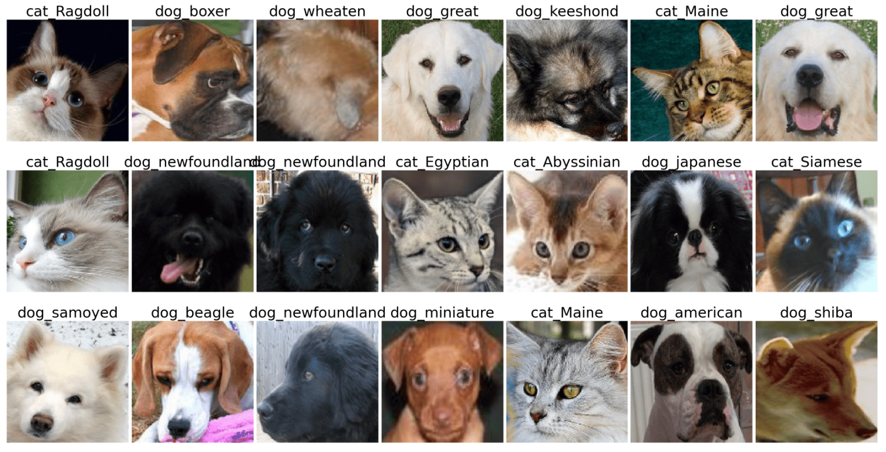

# Clasificación de Caras de Mascotas

Tarea del [Currículo de IA para Principiantes](https://github.com/microsoft/ai-for-beginners).

## Tarea

Imagina que necesitas desarrollar una aplicación para una guardería de mascotas para catalogar todos los animales. Una de las grandes características de tal aplicación sería descubrir automáticamente la raza a partir de una fotografía. Esto se puede lograr con éxito utilizando redes neuronales.

Necesitas entrenar una red neuronal convolucional para clasificar diferentes razas de gatos y perros utilizando el conjunto de datos **Caras de Mascotas**.

## El Conjunto de Datos

Usaremos el conjunto de datos **Caras de Mascotas**, derivado del conjunto de datos de mascotas [Oxford-IIIT](https://www.robots.ox.ac.uk/~vgg/data/pets/). Contiene 35 razas diferentes de perros y gatos.



Para descargar el conjunto de datos, utiliza este fragmento de código:

```python
!wget https://mslearntensorflowlp.blob.core.windows.net/data/petfaces.tar.gz
!tar xfz petfaces.tar.gz
!rm petfaces.tar.gz
```

## Iniciando el Notebook

Comienza el laboratorio abriendo [PetFaces.ipynb](../../../../../../lessons/4-ComputerVision/07-ConvNets/lab/PetFaces.ipynb).

## Conclusión

¡Has resuelto un problema relativamente complejo de clasificación de imágenes desde cero! Había muchas clases, ¡y aún así lograste obtener una precisión razonable! También tiene sentido medir la precisión top-k, ya que es fácil confundir algunas de las clases que no son claramente diferentes incluso para los seres humanos.

**Disclaimer**: 
This document has been translated using machine-based AI translation services. While we strive for accuracy, please be aware that automated translations may contain errors or inaccuracies. The original document in its native language should be considered the authoritative source. For critical information, professional human translation is recommended. We are not liable for any misunderstandings or misinterpretations arising from the use of this translation.