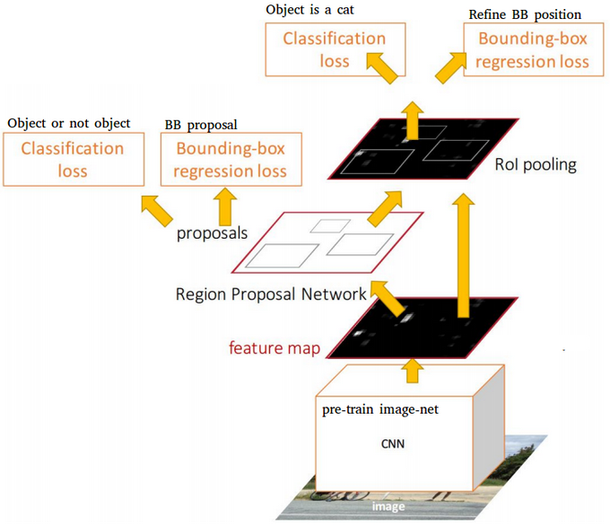

# 物体検出

これまで扱ってきた画像分類モデルは、画像を入力としてクラス「数字」のようなカテゴリ結果を出力しました。しかし、多くの場合、単に画像に物体が描かれていることを知るだけでなく、それらの正確な位置を特定できるようにしたいのです。これがまさに**物体検出**の目的です。

## [プレ講義クイズ](https://red-field-0a6ddfd03.1.azurestaticapps.net/quiz/111)

> 画像出典：[YOLO v2 ウェブサイト](https://pjreddie.com/darknet/yolov2/)

## 物体検出へのナイーブなアプローチ

もし、画像の中に猫を見つけたいと仮定すると、非常にナイーブな物体検出のアプローチは以下のようになります。

1. 画像をいくつかのタイルに分割する
2. 各タイルに対して画像分類を実行する
3. 十分に高い活性化を示すタイルは、問題の物体を含むと見なされます。

> *画像出典：[演習ノートブック](../../../../../lessons/4-ComputerVision/11-ObjectDetection/ObjectDetection-TF.ipynb)*

しかし、このアプローチは理想から遠く、アルゴリズムが物体のバウンディングボックスを非常に不正確に特定することしかできません。より正確な位置を得るためには、バウンディングボックスの座標を予測するための何らかの**回帰**を実行する必要があり、そのためには特定のデータセットが必要です。

## 物体検出のための回帰

[このブログ記事](https://towardsdatascience.com/object-detection-with-neural-networks-a4e2c46b4491)は、形状検出の優れた入門を提供しています。

## 物体検出のためのデータセット

このタスクに関連するデータセットには以下のものがあります。

* [PASCAL VOC](http://host.robots.ox.ac.uk/pascal/VOC/) - 20クラス
* [COCO](http://cocodataset.org/#home) - 文脈における一般的な物体。80クラス、バウンディングボックスおよびセグメンテーションマスク

## 物体検出のメトリクス

### IoU（Intersection over Union）

画像分類の場合、アルゴリズムのパフォーマンスを測定するのは簡単ですが、物体検出ではクラスの正確さと推測されたバウンディングボックスの位置の精度の両方を測定する必要があります。後者には、いわゆる**IoU（Intersection over Union）**を使用し、2つのボックス（または2つの任意の領域）がどれだけ重なっているかを測定します。

> *図2：[この優れたIoUに関するブログ記事](https://pyimagesearch.com/2016/11/07/intersection-over-union-iou-for-object-detection/)から*

アイデアはシンプルです - 2つの図形の交差部分の面積を、その和の面積で割ります。2つの同一の領域では、IoUは1になり、完全に離れた領域では0になります。それ以外の場合は0から1の間で変動します。通常、IoUが特定の値を超えるバウンディングボックスのみを考慮します。

### 平均精度

特定の物体クラス$C$がどれだけ認識されているかを測定したいとしましょう。それを測定するために、**平均精度**メトリクスを使用します。これは以下のように計算されます。

1. 精度-再現率曲線が、検出しきい値（0から1まで）に依存する精度を示すことを考慮します。
2. しきい値に応じて、画像内で検出される物体の数が増減し、精度と再現率の異なる値が得られます。
3. 曲線はこのようになります：

> *画像出典：[NeuroWorkshop](http://github.com/shwars/NeuroWorkshop)*

与えられたクラス$C$の平均精度は、この曲線の下の面積です。より正確には、再現率軸は通常10部分に分けられ、精度はすべてのポイントで平均されます：

$$
AP = {1\over11}\sum_{i=0}^{10}\mbox{Precision}(\mbox{Recall}={i\over10})
$$

### APとIoU

IoUが特定の値を超える検出のみを考慮します。たとえば、PASCAL VOCデータセットでは通常$\mbox{IoU Threshold} = 0.5$が想定されており、COCOでは異なる$\mbox{IoU Threshold}$の値でAPが測定されます。 

> *画像出典：[NeuroWorkshop](http://github.com/shwars/NeuroWorkshop)*

### 平均平均精度 - mAP

物体検出の主なメトリクスは**平均平均精度**、または**mAP**と呼ばれています。これは、すべての物体クラスにわたる平均精度の値であり、時には$\mbox{IoU Threshold}$にわたっても平均されます。より詳細には、**mAP**を計算するプロセスは[このブログ記事](https://medium.com/@timothycarlen/understanding-the-map-evaluation-metric-for-object-detection-a07fe6962cf3)で説明されており、[こちらにはコードサンプルがあります](https://gist.github.com/tarlen5/008809c3decf19313de216b9208f3734)。

## 異なる物体検出アプローチ

物体検出アルゴリズムには大きく分けて2つのクラスがあります。

* **領域提案ネットワーク**（R-CNN、Fast R-CNN、Faster R-CNN）。主なアイデアは、**関心領域**（ROI）を生成し、それらの上でCNNを実行して最大の活性化を探すことです。これはナイーブなアプローチに少し似ていますが、ROIはより巧妙な方法で生成されます。このような方法の主な欠点の1つは、画像上でCNN分類器を多くのパスで実行する必要があるため遅いことです。
* **一回のパス**（YOLO、SSD、RetinaNet）メソッド。これらのアーキテクチャでは、ネットワークを設計して、クラスとROIの両方を一度のパスで予測します。

### R-CNN: 領域ベースのCNN

[R-CNN](http://islab.ulsan.ac.kr/files/announcement/513/rcnn_pami.pdf)は、[Selective Search](http://www.huppelen.nl/publications/selectiveSearchDraft.pdf)を使用してROI領域の階層構造を生成し、それをCNN特徴抽出器とSVM分類器に通して物体クラスを特定し、線形回帰を使用して*バウンディングボックス*の座標を決定します。[公式論文](https://arxiv.org/pdf/1506.01497v1.pdf)

> *画像出典：van de Sande et al. ICCV’11*

> *画像出典：[このブログ](https://towardsdatascience.com/r-cnn-fast-r-cnn-faster-r-cnn-yolo-object-detection-algorithms-36d53571365e)*

### F-RCNN - Fast R-CNN

このアプローチはR-CNNに似ていますが、領域は畳み込み層が適用された後に定義されます。

> 画像出典：[公式論文](https://www.cv-foundation.org/openaccess/content_iccv_2015/papers/Girshick_Fast_R-CNN_ICCV_2015_paper.pdf)、[arXiv](https://arxiv.org/pdf/1504.08083.pdf)、2015年

### Faster R-CNN

このアプローチの主なアイデアは、ニューラルネットワークを使用してROIを予測することです - いわゆる*領域提案ネットワーク*。[論文](https://arxiv.org/pdf/1506.01497.pdf)、2016年

> 画像出典：[公式論文](https://arxiv.org/pdf/1506.01497.pdf)

### R-FCN: 領域ベースの完全畳み込みネットワーク

このアルゴリズムはFaster R-CNNよりもさらに高速です。主なアイデアは次の通りです。

1. ResNet-101を使用して特徴を抽出します
2. 特徴は**位置感受性スコアマップ**によって処理されます。$C$クラスの各物体は$k\times k$領域に分割され、物体の部分を予測するように訓練されます。
3. $k\times k$領域の各部分について、すべてのネットワークが物体クラスに投票し、最大の投票を得た物体クラスが選択されます。

> 画像出典：[公式論文](https://arxiv.org/abs/1605.06409)

### YOLO - You Only Look Once

YOLOはリアルタイムの一回のパスアルゴリズムです。主なアイデアは次の通りです。

* 画像を$S\times S$領域に分割します
* 各領域に対して、**CNN**が$n$個の可能な物体、*バウンディングボックス*の座標、および*信頼度*=*確率* * IoUを予測します。

> 画像は[公式論文](https://arxiv.org/abs/1506.02640)からのものです。

### その他のアルゴリズム

* RetinaNet: [公式論文](https://arxiv.org/abs/1708.02002)
   - [TorchvisionによるPyTorch実装](https://pytorch.org/vision/stable/_modules/torchvision/models/detection/retinanet.html)
   - [Keras実装](https://github.com/fizyr/keras-retinanet)
   - Kerasサンプルの[RetinaNetによる物体検出](https://keras.io/examples/vision/retinanet/)
* SSD (Single Shot Detector): [公式論文](https://arxiv.org/abs/1512.02325)

## ✍️ 演習: 物体検出

以下のノートブックで学習を続けましょう：

[ObjectDetection.ipynb](../../../../../lessons/4-ComputerVision/11-ObjectDetection/ObjectDetection.ipynb)

## 結論

このレッスンでは、物体検出が達成できるさまざまな方法を駆け足で紹介しました！

## 🚀 チャレンジ

これらのYOLOに関する記事やノートブックを読んで、自分で試してみてください。

* YOLOについて説明した[良いブログ記事](https://www.analyticsvidhya.com/blog/2018/12/practical-guide-object-detection-yolo-framewor-python/)
 * [公式サイト](https://pjreddie.com/darknet/yolo/)
 * Yolo: [Keras実装](https://github.com/experiencor/keras-yolo2)、[ステップバイステップノートブック](https://github.com/experiencor/basic-yolo-keras/blob/master/Yolo%20Step-by-Step.ipynb)
 * Yolo v2: [Keras実装](https://github.com/experiencor/keras-yolo2)、[ステップバイステップノートブック](https://github.com/experiencor/keras-yolo2/blob/master/Yolo%20Step-by-Step.ipynb)

## [講義後のクイズ](https://red-field-0a6ddfd03.1.azurestaticapps.net/quiz/211)

## レビュー & 自習

* Nikhil Sardanaによる[物体検出](https://tjmachinelearning.com/lectures/1718/obj/)
* [物体検出アルゴリズムの良い比較](https://lilianweng.github.io/lil-log/2018/12/27/object-detection-part-4.html)
* [物体検出のための深層学習アルゴリズムのレビュー](https://medium.com/comet-app/review-of-deep-learning-algorithms-for-object-detection-c1f3d437b852)
* [基本的な物体検出アルゴリズムのステップバイステップの紹介](https://www.analyticsvidhya.com/blog/2018/10/a-step-by-step-introduction-to-the-basic-object-detection-algorithms-part-1/)
* [物体検出のためのPythonにおけるFaster R-CNNの実装](https://www.analyticsvidhya.com/blog/2018/11/implementation-faster-r-cnn-python-object-detection/)

## [課題: 物体検出](lab/README.md)

**免責事項**:  
この文書は、機械ベースのAI翻訳サービスを使用して翻訳されました。正確性を追求していますが、自動翻訳にはエラーや不正確さが含まれる可能性があることをご理解ください。原文はその言語での権威ある情報源と見なされるべきです。重要な情報については、専門の人間翻訳を推奨します。この翻訳の使用に起因する誤解や誤解釈については、当社は責任を負いません。