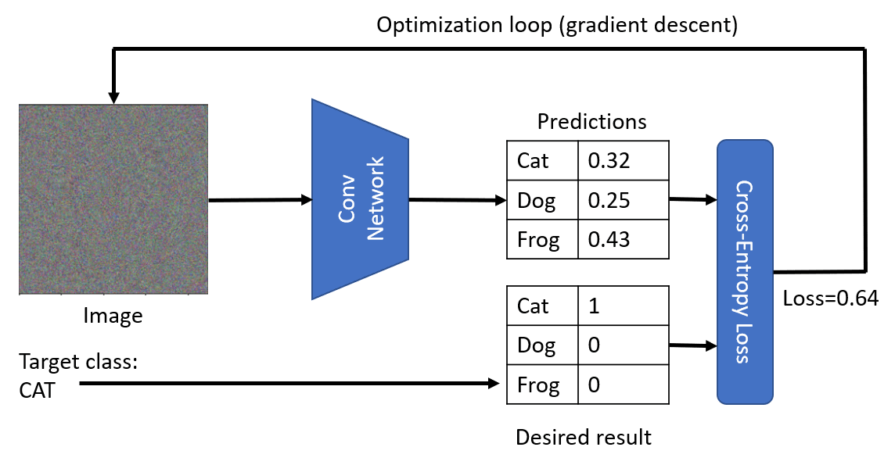

# 사전 훈련된 네트워크와 전이 학습

CNN을 훈련하는 데는 많은 시간과 데이터가 필요합니다. 그러나 많은 시간은 네트워크가 이미지에서 패턴을 추출하기 위해 사용할 수 있는 최적의 저수준 필터를 배우는 데 소요됩니다. 자연스러운 질문이 생깁니다 - 하나의 데이터셋에서 훈련된 신경망을 사용하여 전체 훈련 과정 없이 다른 이미지를 분류하는 데 적응할 수 있을까요?

## [강의 전 퀴즈](https://red-field-0a6ddfd03.1.azurestaticapps.net/quiz/108)

이 접근 방식을 **전이 학습**이라고 합니다. 이는 하나의 신경망 모델에서 다른 모델로 지식을 전이하기 때문입니다. 전이 학습에서는 일반적으로 **ImageNet**과 같은 대규모 이미지 데이터셋에서 훈련된 사전 훈련된 모델로 시작합니다. 이러한 모델은 일반적인 이미지에서 다양한 특징을 추출하는 데 이미 좋은 성능을 보이며, 경우에 따라 이러한 추출된 특징 위에 분류기를 구축하는 것만으로도 좋은 결과를 얻을 수 있습니다.

> ✅ 전이 학습은 교육과 같은 다른 학문 분야에서 발견되는 용어입니다. 이는 한 도메인에서 지식을 가져와 다른 도메인에 적용하는 과정을 의미합니다.

## 특징 추출기로서의 사전 훈련된 모델

이전 섹션에서 이야기한 컨볼루션 네트워크는 여러 층으로 구성되어 있으며, 각 층은 이미지에서 저수준의 픽셀 조합(예: 수평/수직 선 또는 스트로크)부터 시작하여 불꽃의 눈과 같은 더 높은 수준의 특징 조합을 추출하는 역할을 합니다. CNN을 충분히 큰 일반적이고 다양한 이미지 데이터셋에서 훈련하면 네트워크는 이러한 공통 특징을 추출하는 방법을 배워야 합니다.

Keras와 PyTorch 모두 일반적인 아키텍처에 대해 사전 훈련된 신경망 가중치를 쉽게 로드하는 기능을 포함하고 있으며, 대부분은 ImageNet 이미지에서 훈련되었습니다. 가장 많이 사용되는 것들은 이전 수업의 [CNN 아키텍처](../07-ConvNets/CNN_Architectures.md) 페이지에 설명되어 있습니다. 특히 다음 중 하나를 고려할 수 있습니다:

* **VGG-16/VGG-19**: 상대적으로 간단한 모델이지만 여전히 좋은 정확도를 제공합니다. VGG를 첫 번째 시도로 사용하는 것은 전이 학습이 어떻게 작동하는지 확인하는 좋은 선택입니다.
* **ResNet**: 2015년 Microsoft Research에서 제안한 모델 패밀리입니다. 더 많은 층을 가지고 있어 자원이 더 많이 필요합니다.
* **MobileNet**: 모바일 장치에 적합한 크기가 줄어든 모델 패밀리입니다. 자원이 부족하고 약간의 정확도를 희생할 수 있는 경우 사용하세요.

다음은 VGG-16 네트워크가 고양이 사진에서 추출한 샘플 특징입니다:

## 고양이와 개 데이터셋

이번 예제에서는 실제 이미지 분류 시나리오와 매우 유사한 [고양이와 개](https://www.microsoft.com/download/details.aspx?id=54765&WT.mc_id=academic-77998-cacaste) 데이터셋을 사용할 것입니다.

## ✍️ 연습: 전이 학습

해당 노트북에서 전이 학습이 작동하는 모습을 살펴보겠습니다:

* [전이 학습 - PyTorch](../../../../../lessons/4-ComputerVision/08-TransferLearning/TransferLearningPyTorch.ipynb)
* [전이 학습 - TensorFlow](../../../../../lessons/4-ComputerVision/08-TransferLearning/TransferLearningTF.ipynb)

## 적대적 고양이 시각화

사전 훈련된 신경망은 *브레인* 내부에 다양한 패턴을 포함하고 있으며, **이상적인 고양이**(뿐만 아니라 이상적인 개, 이상적인 얼룩말 등)의 개념도 포함되어 있습니다. 이 이미지를 어떻게든 **시각화하는 것이 흥미로울 것입니다**. 그러나 이는 간단하지 않습니다. 패턴이 네트워크 가중치 전반에 퍼져 있고, 또한 계층 구조로 조직되어 있기 때문입니다.

우리가 취할 수 있는 한 가지 접근 방식은 임의의 이미지로 시작한 다음, **경량 경량 최적화** 기술을 사용하여 네트워크가 그것을 고양이라고 생각하도록 이미지를 조정하는 것입니다.

하지만 이렇게 하면 무작위 잡음과 매우 유사한 결과를 얻게 됩니다. 이는 *입력 이미지가 고양이라고 생각하게 만드는 여러 방법이 있기 때문*이며, 시각적으로 의미가 없는 방법도 포함됩니다. 이러한 이미지에는 고양이에 전형적인 많은 패턴이 포함되어 있지만, 시각적으로 구별되는 것을 제한하는 요소는 없습니다.

결과를 개선하기 위해 우리는 **변화 손실**이라고 하는 또 다른 항목을 손실 함수에 추가할 수 있습니다. 이는 이미지의 이웃 픽셀이 얼마나 유사한지를 나타내는 메트릭입니다. 변화 손실을 최소화하면 이미지를 더 부드럽게 만들고 잡음을 제거하여 시각적으로 더 매력적인 패턴을 드러냅니다. 다음은 고양이와 얼룩말로 높은 확률로 분류된 "이상적인" 이미지의 예입니다:

 | 
-----|-----
 *이상적인 고양이* | *이상적인 얼룩말*

유사한 접근 방식을 사용하여 신경망에 대한 **적대적 공격**을 수행할 수 있습니다. 신경망을 속여 개를 고양이처럼 보이게 하려고 한다고 가정해 보겠습니다. 네트워크가 개로 인식하는 개의 이미지를 가져오면, 경량 경량 최적화를 사용하여 약간 조정한 후 네트워크가 이를 고양이로 분류하기 시작할 때까지 진행할 수 있습니다:

 | 
-----|-----
*원래 개 사진* | *고양이로 분류된 개 사진*

위 결과를 재현하기 위한 코드는 다음 노트북에서 확인할 수 있습니다:

* [이상적인 고양이와 적대적 고양이 - TensorFlow](../../../../../lessons/4-ComputerVision/08-TransferLearning/AdversarialCat_TF.ipynb)

## 결론

전이 학습을 사용하면 사용자 정의 객체 분류 작업을 위한 분류기를 빠르게 구성하고 높은 정확도를 달성할 수 있습니다. 현재 우리가 해결하고 있는 더 복잡한 작업은 더 높은 계산 능력을 요구하며 CPU에서 쉽게 해결할 수 없습니다. 다음 단원에서는 더 낮은 계산 자원을 사용하여 동일한 모델을 훈련하기 위해 더 가벼운 구현을 사용해 볼 것이며, 이는 정확도가 약간 낮아지는 결과를 가져올 것입니다.

## 🚀 도전 과제

동반된 노트북에는 전이 지식이 유사한 훈련 데이터(아마도 새로운 동물 유형)와 가장 잘 작동하는 방법에 대한 노트가 있습니다. 완전히 새로운 유형의 이미지로 실험을 해보아 전이 지식 모델이 얼마나 잘 작동하는지 확인해 보세요.

## [강의 후 퀴즈](https://red-field-0a6ddfd03.1.azurestaticapps.net/quiz/208)

## 복습 및 자기 학습

모델 훈련의 다른 방법에 대한 지식을 심화하기 위해 [TrainingTricks.md](TrainingTricks.md)를 읽어보세요.

## [과제](lab/README.md)

이번 실습에서는 35종의 고양이와 개가 포함된 실제 [옥스포드-IIIT](https://www.robots.ox.ac.uk/~vgg/data/pets/) 애완동물 데이터셋을 사용하여 전이 학습 분류기를 구축할 것입니다.

**면책 조항**:  
이 문서는 기계 기반 AI 번역 서비스를 사용하여 번역되었습니다. 정확성을 위해 노력하고 있지만, 자동 번역에는 오류나 부정확성이 포함될 수 있습니다. 원본 문서는 해당 언어로 작성된 권위 있는 출처로 간주되어야 합니다. 중요한 정보에 대해서는 전문 인간 번역을 권장합니다. 이 번역의 사용으로 인해 발생하는 오해나 잘못된 해석에 대해 우리는 책임을 지지 않습니다.