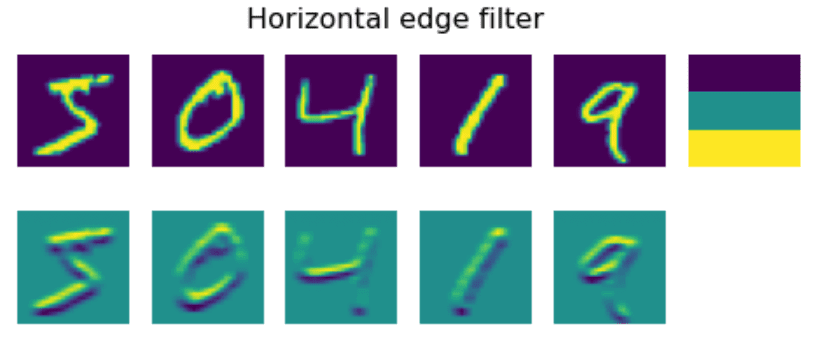

# Rangkaian Neural Konvolusional

Kita telah melihat sebelumnya bahawa rangkaian neural cukup baik dalam menangani gambar, dan bahkan perceptron satu lapisan mampu mengenali digit tulisan tangan dari dataset MNIST dengan ketepatan yang wajar. Namun, dataset MNIST sangat istimewa, dan semua digit berada di tengah gambar, yang menjadikan tugas ini lebih mudah.

## [Kuiz Pra-ceramah](https://red-field-0a6ddfd03.1.azurestaticapps.net/quiz/107)

Dalam kehidupan sebenar, kita ingin dapat mengenali objek dalam gambar tanpa mengira lokasi tepat mereka dalam gambar. Penglihatan komputer berbeza dari pengelasan umum, kerana apabila kita cuba mencari objek tertentu dalam gambar, kita sedang mengimbas gambar mencari beberapa **corak** tertentu dan kombinasi mereka. Sebagai contoh, apabila mencari kucing, kita mungkin terlebih dahulu mencari garis mendatar, yang dapat membentuk misai, dan kemudian kombinasi tertentu dari misai dapat memberitahu kita bahawa ini sebenarnya adalah gambar kucing. Posisi relatif dan kehadiran corak tertentu adalah penting, dan bukan posisi tepat mereka dalam gambar.

Untuk mengekstrak corak, kita akan menggunakan konsep **penapis konvolusional**. Seperti yang anda tahu, gambar diwakili oleh matriks 2D, atau tensor 3D dengan kedalaman warna. Mengaplikasikan penapis bermakna kita mengambil matriks **kernel penapis** yang relatif kecil, dan untuk setiap piksel dalam gambar asal kita mengira purata tertimbang dengan titik-titik jiran. Kita boleh melihat ini seperti sebuah tingkap kecil yang meluncur ke seluruh gambar, dan merata-rata semua piksel mengikut berat dalam matriks kernel penapis.

 | 
----|----

> Imej oleh Dmitry Soshnikov

Sebagai contoh, jika kita mengaplikasikan penapis tepi menegak 3x3 dan penapis tepi mendatar kepada digit MNIST, kita dapat mendapatkan sorotan (contohnya, nilai tinggi) di mana terdapat tepi menegak dan mendatar dalam gambar asal kita. Dengan itu, kedua-dua penapis ini boleh digunakan untuk "mencari" tepi. Begitu juga, kita boleh merancang penapis yang berbeza untuk mencari corak rendah yang lain:

> Imej dari [Bank Penapis Leung-Malik](https://www.robots.ox.ac.uk/~vgg/research/texclass/filters.html)

Namun, walaupun kita boleh merancang penapis untuk mengekstrak beberapa corak secara manual, kita juga boleh merancang rangkaian dengan cara yang membolehkannya belajar corak secara automatik. Ini adalah salah satu idea utama di sebalik CNN.

## Idea Utama di Sebalik CNN

Cara CNN berfungsi adalah berdasarkan idea penting berikut:

* Penapis konvolusional boleh mengekstrak corak
* Kita boleh merancang rangkaian dengan cara yang penapis dilatih secara automatik
* Kita boleh menggunakan pendekatan yang sama untuk mencari corak dalam ciri tahap tinggi, bukan hanya dalam gambar asal. Oleh itu, pengekstrakan ciri CNN berfungsi pada hierarki ciri, bermula dari kombinasi piksel tahap rendah, hingga kombinasi bahagian gambar yang lebih tinggi.

> Imej dari [kertas oleh Hislop-Lynch](https://www.semanticscholar.org/paper/Computer-vision-based-pedestrian-trajectory-Hislop-Lynch/26e6f74853fc9bbb7487b06dc2cf095d36c9021d), berdasarkan [penyelidikan mereka](https://dl.acm.org/doi/abs/10.1145/1553374.1553453)

## ✍️ Latihan: Rangkaian Neural Konvolusional

Mari kita terus meneroka bagaimana rangkaian neural konvolusional berfungsi, dan bagaimana kita dapat mencapai penapis yang boleh dilatih, dengan mengerjakan buku nota yang berkaitan:

* [Rangkaian Neural Konvolusional - PyTorch](../../../../../lessons/4-ComputerVision/07-ConvNets/ConvNetsPyTorch.ipynb)
* [Rangkaian Neural Konvolusional - TensorFlow](../../../../../lessons/4-ComputerVision/07-ConvNets/ConvNetsTF.ipynb)

## Senibina Piramid

Kebanyakan CNN yang digunakan untuk pemprosesan imej mengikuti senibina piramid yang dipanggil. Lapisan konvolusional pertama yang diterapkan pada gambar asal biasanya mempunyai bilangan penapis yang agak rendah (8-16), yang sepadan dengan kombinasi piksel yang berbeza, seperti garis mendatar/menegak strok. Di peringkat seterusnya, kita mengurangkan dimensi spatial rangkaian, dan meningkatkan bilangan penapis, yang sepadan dengan lebih banyak kombinasi ciri sederhana yang mungkin. Dengan setiap lapisan, apabila kita bergerak ke arah pengklasifikasi akhir, dimensi spatial gambar berkurang, dan bilangan penapis meningkat.

Sebagai contoh, mari kita lihat senibina VGG-16, sebuah rangkaian yang mencapai ketepatan 92.7% dalam pengelasan top-5 ImageNet pada tahun 2014:

> Imej dari [Researchgate](https://www.researchgate.net/figure/Vgg16-model-structure-To-get-the-VGG-NIN-model-we-replace-the-2-nd-4-th-6-th-7-th_fig2_335194493)

## Senibina CNN Terkenal

[Teruskan pembelajaran anda mengenai senibina CNN yang paling terkenal](CNN_Architectures.md)

**Penafian**: 
Dokumen ini telah diterjemahkan menggunakan perkhidmatan terjemahan berasaskan AI. Walaupun kami berusaha untuk ketepatan, sila ambil perhatian bahawa terjemahan automatik mungkin mengandungi kesilapan atau ketidaktepatan. Dokumen asal dalam bahasa asalnya harus dianggap sebagai sumber yang sah. Untuk maklumat yang kritikal, terjemahan manusia yang profesional disyorkan. Kami tidak bertanggungjawab atas sebarang salah faham atau salah tafsir yang timbul daripada penggunaan terjemahan ini.