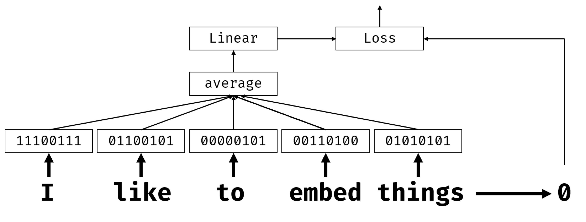

# Embeddings

## [Quiz pré-aula](https://red-field-0a6ddfd03.1.azurestaticapps.net/quiz/114)

Ao treinar classificadores baseados em BoW ou TF/IDF, operamos em vetores de bag-of-words de alta dimensão com comprimento `vocab_size`, e estávamos convertendo explicitamente de vetores de representação posicional de baixa dimensão para uma representação one-hot esparsa. No entanto, essa representação one-hot não é eficiente em termos de memória. Além disso, cada palavra é tratada de forma independente, ou seja, vetores codificados em one-hot não expressam nenhuma similaridade semântica entre as palavras.

A ideia de **embedding** é representar palavras por vetores densos de menor dimensão, que de alguma forma refletem o significado semântico de uma palavra. Mais adiante, discutiremos como construir embeddings de palavras significativos, mas por enquanto, vamos pensar nos embeddings como uma forma de reduzir a dimensionalidade de um vetor de palavras.

Assim, a camada de embedding receberia uma palavra como entrada e produziria um vetor de saída de tamanho especificado `embedding_size`. De certa forma, é muito semelhante a uma camada `Linear`, mas em vez de receber um vetor codificado em one-hot, ela poderá receber um número de palavra como entrada, permitindo-nos evitar a criação de grandes vetores codificados em one-hot.

Ao usar uma camada de embedding como a primeira camada em nossa rede de classificadores, podemos mudar de um modelo de bag-of-words para um modelo de **embedding bag**, onde primeiro convertemos cada palavra em nosso texto em seu correspondente embedding e, em seguida, calculamos alguma função agregada sobre todos esses embeddings, como `sum`, `average` ou `max`.  

> Imagem do autor

## ✍️ Exercícios: Embeddings

Continue seu aprendizado nos seguintes notebooks:
* [Embeddings com PyTorch](../../../../../lessons/5-NLP/14-Embeddings/EmbeddingsPyTorch.ipynb)
* [Embeddings TensorFlow](../../../../../lessons/5-NLP/14-Embeddings/EmbeddingsTF.ipynb)

## Embeddings Semânticos: Word2Vec

Enquanto a camada de embedding aprendeu a mapear palavras para representação vetorial, essa representação não necessariamente tinha muito significado semântico. Seria interessante aprender uma representação vetorial de modo que palavras semelhantes ou sinônimos corresponderiam a vetores que estão próximos uns dos outros em termos de alguma distância vetorial (por exemplo, distância euclidiana).

Para isso, precisamos pré-treinar nosso modelo de embedding em uma grande coleção de textos de uma maneira específica. Uma forma de treinar embeddings semânticos é chamada de [Word2Vec](https://en.wikipedia.org/wiki/Word2vec). É baseada em duas arquiteturas principais que são usadas para produzir uma representação distribuída de palavras:

 - **Continuous bag-of-words** (CBoW) — nesta arquitetura, treinamos o modelo para prever uma palavra a partir do contexto ao seu redor. Dado o ngram $(W_{-2},W_{-1},W_0,W_1,W_2)$, o objetivo do modelo é prever $W_0$ a partir de $(W_{-2},W_{-1},W_1,W_2)$.
 - **Continuous skip-gram** é o oposto do CBoW. O modelo usa uma janela de palavras de contexto ao redor para prever a palavra atual.

CBoW é mais rápido, enquanto skip-gram é mais lento, mas faz um trabalho melhor ao representar palavras infrequentes.

> Imagem deste [artigo](https://arxiv.org/pdf/1301.3781.pdf)

Os embeddings pré-treinados do Word2Vec (assim como outros modelos similares, como o GloVe) também podem ser usados no lugar da camada de embedding em redes neurais. No entanto, precisamos lidar com vocabulários, pois o vocabulário usado para pré-treinar o Word2Vec/GloVe provavelmente difere do vocabulário em nosso corpus de texto. Dê uma olhada nos Notebooks acima para ver como esse problema pode ser resolvido.

## Embeddings Contextuais

Uma limitação chave das representações de embedding pré-treinadas tradicionais, como o Word2Vec, é o problema da desambiguação de sentido das palavras. Embora os embeddings pré-treinados possam capturar parte do significado das palavras em contexto, cada possível significado de uma palavra é codificado no mesmo embedding. Isso pode causar problemas em modelos posteriores, uma vez que muitas palavras, como a palavra 'play', têm significados diferentes dependendo do contexto em que são usadas.

Por exemplo, a palavra 'play' nas duas frases diferentes tem significados bastante distintos:

- Eu fui a uma **peça** no teatro.
- John quer **brincar** com seus amigos.

Os embeddings pré-treinados acima representam ambos os significados da palavra 'play' no mesmo embedding. Para superar essa limitação, precisamos construir embeddings baseados no **modelo de linguagem**, que é treinado em um grande corpus de texto e *sabe* como as palavras podem ser combinadas em diferentes contextos. Discutir embeddings contextuais está fora do escopo deste tutorial, mas voltaremos a eles ao falar sobre modelos de linguagem mais adiante no curso.

## Conclusão

Nesta lição, você descobriu como construir e usar camadas de embedding no TensorFlow e Pytorch para refletir melhor os significados semânticos das palavras.

## 🚀 Desafio

O Word2Vec tem sido usado para algumas aplicações interessantes, incluindo a geração de letras de músicas e poesias. Dê uma olhada neste [artigo](https://www.politetype.com/blog/word2vec-color-poems) que explica como o autor usou o Word2Vec para gerar poesia. Assista também a [este vídeo de Dan Shiffmann](https://www.youtube.com/watch?v=LSS_bos_TPI&ab_channel=TheCodingTrain) para descobrir uma explicação diferente dessa técnica. Em seguida, tente aplicar essas técnicas ao seu próprio corpus de texto, talvez proveniente do Kaggle.

## [Quiz pós-aula](https://red-field-0a6ddfd03.1.azurestaticapps.net/quiz/214)

## Revisão & Autoestudo

Leia este artigo sobre Word2Vec: [Estimativa Eficiente de Representações de Palavras em Espaço Vetorial](https://arxiv.org/pdf/1301.3781.pdf)

## [Tarefa: Notebooks](assignment.md)

**Isenção de responsabilidade**:  
Este documento foi traduzido usando serviços de tradução baseados em IA. Embora nos esforcemos pela precisão, esteja ciente de que traduções automatizadas podem conter erros ou imprecisões. O documento original em seu idioma nativo deve ser considerado a fonte autoritativa. Para informações críticas, recomenda-se a tradução profissional feita por humanos. Não nos responsabilizamos por quaisquer mal-entendidos ou interpretações errôneas decorrentes do uso desta tradução.