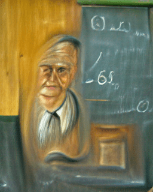

# Redes Multi-Modais

Após o sucesso dos modelos transformer para resolver tarefas de PNL, as mesmas ou arquiteturas semelhantes foram aplicadas a tarefas de visão computacional. Há um crescente interesse em construir modelos que *combinarão* capacidades de visão e linguagem natural. Uma dessas tentativas foi feita pela OpenAI, e é chamada CLIP e DALL.E.

## Pré-Treinamento de Imagens Contrastivas (CLIP)

A ideia principal do CLIP é ser capaz de comparar prompts de texto com uma imagem e determinar quão bem a imagem corresponde ao prompt.

> *Imagem do [este post no blog](https://openai.com/blog/clip/)*

O modelo é treinado em imagens obtidas da Internet e suas legendas. Para cada lote, pegamos N pares de (imagem, texto) e os convertendo em algumas representações vetoriais I e T. Essas representações são então combinadas. A função de perda é definida para maximizar a similaridade cosseno entre vetores correspondentes a um par (por exemplo, I e T), e minimizar a similaridade cosseno entre todos os outros pares. Essa é a razão pela qual essa abordagem é chamada de **contrastiva**.

O modelo/biblioteca CLIP está disponível no [GitHub da OpenAI](https://github.com/openai/CLIP). A abordagem é descrita [neste post no blog](https://openai.com/blog/clip/), e em mais detalhes [neste artigo](https://arxiv.org/pdf/2103.00020.pdf).

Uma vez que este modelo é pré-treinado, podemos fornecer um lote de imagens e um lote de prompts de texto, e ele retornará um tensor com as probabilidades. O CLIP pode ser usado para várias tarefas:

**Classificação de Imagens**

Suponha que precisamos classificar imagens entre, digamos, gatos, cães e humanos. Nesse caso, podemos fornecer ao modelo uma imagem e uma série de prompts de texto: "*uma imagem de um gato*", "*uma imagem de um cachorro*", "*uma imagem de um humano*". No vetor resultante de 3 probabilidades, precisamos apenas selecionar o índice com o valor mais alto.

> *Imagem do [este post no blog](https://openai.com/blog/clip/)*

**Busca de Imagens Baseada em Texto**

Podemos também fazer o oposto. Se tivermos uma coleção de imagens, podemos passar essa coleção para o modelo e um prompt de texto - isso nos dará a imagem que é mais semelhante ao prompt dado.

## ✍️ Exemplo: [Usando CLIP para Classificação de Imagens e Busca de Imagens](../../../../../lessons/X-Extras/X1-MultiModal/Clip.ipynb)

Abra o [Clip.ipynb](../../../../../lessons/X-Extras/X1-MultiModal/Clip.ipynb) notebook para ver o CLIP em ação.

## Geração de Imagens com VQGAN+ CLIP

O CLIP também pode ser usado para **geração de imagens** a partir de um prompt de texto. Para fazer isso, precisamos de um **modelo gerador** que seja capaz de gerar imagens com base em algum vetor de entrada. Um desses modelos é chamado [VQGAN](https://compvis.github.io/taming-transformers/) (GAN Quantizado por Vetores).

As principais ideias do VQGAN que o diferenciam de um [GAN](../../4-ComputerVision/10-GANs/README.md) comum são as seguintes:
* Usar uma arquitetura de transformer autorregressiva para gerar uma sequência de partes visuais ricas em contexto que compõem a imagem. Essas partes visuais são, por sua vez, aprendidas por [CNN](../../4-ComputerVision/07-ConvNets/README.md)
* Usar um discriminador de sub-imagem que detecta se partes da imagem são "reais" ou "falsas" (diferente da abordagem "tudo ou nada" em GANs tradicionais).

Saiba mais sobre VQGAN no site [Taming Transformers](https://compvis.github.io/taming-transformers/).

Uma das diferenças importantes entre VQGAN e GANs tradicionais é que este último pode produzir uma imagem decente a partir de qualquer vetor de entrada, enquanto o VQGAN provavelmente produzirá uma imagem que não será coerente. Assim, precisamos guiar ainda mais o processo de criação da imagem, e isso pode ser feito usando o CLIP.

Para gerar uma imagem correspondente a um prompt de texto, começamos com algum vetor de codificação aleatório que é passado pelo VQGAN para produzir uma imagem. Então, o CLIP é usado para produzir uma função de perda que mostra quão bem a imagem corresponde ao prompt de texto. O objetivo, então, é minimizar essa perda, usando retropropagação para ajustar os parâmetros do vetor de entrada.

Uma ótima biblioteca que implementa VQGAN+CLIP é [Pixray](http://github.com/pixray/pixray)

 |   | 
----|----|----
Imagem gerada a partir do prompt *um retrato em aquarela de close-up de um jovem professor de literatura com um livro* | Imagem gerada a partir do prompt *um retrato em óleo de close-up de uma jovem professora de ciência da computação com um computador* | Imagem gerada a partir do prompt *um retrato em óleo de close-up de um velho professor de matemática na frente do quadro negro*

> Imagens da coleção **Professores Artificiais** por [Dmitry Soshnikov](http://soshnikov.com)

## DALL-E
### [DALL-E 1](https://openai.com/research/dall-e)
DALL-E é uma versão do GPT-3 treinada para gerar imagens a partir de prompts. Ele foi treinado com 12 bilhões de parâmetros.

Diferente do CLIP, o DALL-E recebe tanto texto quanto imagem como um único fluxo de tokens para imagens e texto. Portanto, a partir de múltiplos prompts, você pode gerar imagens com base no texto.

### [DALL-E 2](https://openai.com/dall-e-2)
A principal diferença entre DALL-E 1 e 2 é que ele gera imagens e arte mais realistas.

Exemplos de gerações de imagens com DALL-E:
 |   | 
----|----|----
Imagem gerada a partir do prompt *um retrato em aquarela de close-up de um jovem professor de literatura com um livro* | Imagem gerada a partir do prompt *um retrato em óleo de close-up de uma jovem professora de ciência da computação com um computador* | Imagem gerada a partir do prompt *um retrato em óleo de close-up de um velho professor de matemática na frente do quadro negro*

## Referências

* Artigo do VQGAN: [Taming Transformers for High-Resolution Image Synthesis](https://compvis.github.io/taming-transformers/paper/paper.pdf)
* Artigo do CLIP: [Learning Transferable Visual Models From Natural Language Supervision](https://arxiv.org/pdf/2103.00020.pdf)

**Isenção de responsabilidade**:  
Este documento foi traduzido utilizando serviços de tradução automática baseados em IA. Embora nos esforcemos pela precisão, esteja ciente de que traduções automatizadas podem conter erros ou imprecisões. O documento original em sua língua nativa deve ser considerado a fonte autorizada. Para informações críticas, recomenda-se a tradução profissional por um humano. Não nos responsabilizamos por quaisquer mal-entendidos ou interpretações errôneas decorrentes do uso desta tradução.