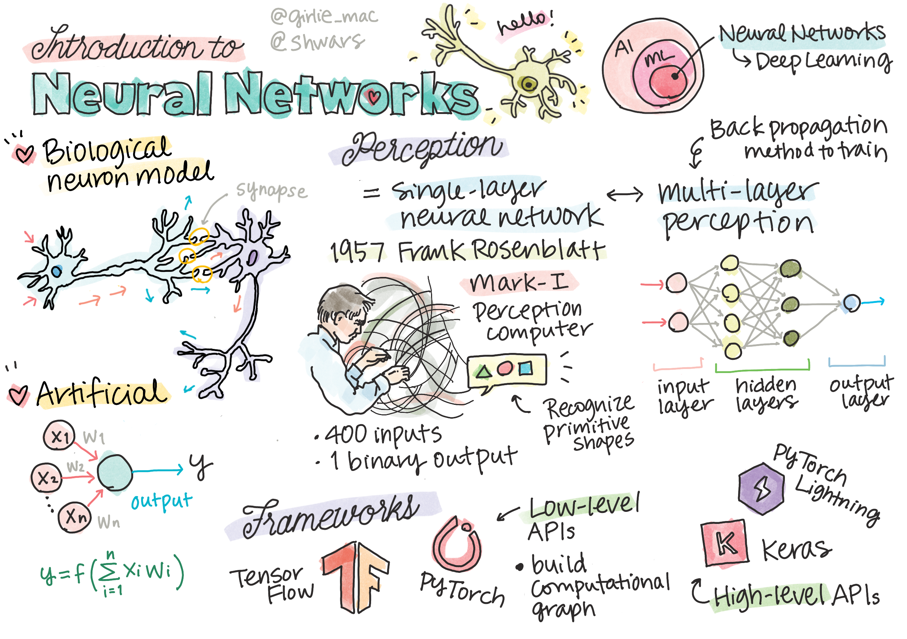

# Введение в Нейронные Сети

Как мы обсудили во введении, одним из способов достижения интеллекта является обучение **компьютерной модели** или **искусственного мозга**. С середины 20 века исследователи пробовали различные математические модели, пока в последние годы это направление не оказалось чрезвычайно успешным. Такие математические модели мозга называются **нейронными сетями**.

> Иногда нейронные сети называют *Искусственными Нейронными Сетями* (Artificial Neural Networks, ANNs), чтобы указать на то, что мы говорим о моделях, а не о реальных сетях нейронов.

## Машинное Обучение

Нейронные сети являются частью более широкой дисциплины, называемой **Машинным Обучением**, цель которой — использовать данные для обучения компьютерных моделей, способных решать задачи. Машинное обучение составляет большую часть Искусственного Интеллекта, однако в этой учебной программе мы не рассматриваем классическое МО.

> Посетите нашу отдельную **[Машинное Обучение для Начинающих](http://github.com/microsoft/ml-for-beginners)** программу, чтобы узнать больше о классическом машинном обучении.

В Машинном Обучении мы предполагаем, что у нас есть некоторый набор данных примеров **X** и соответствующие выходные значения **Y**. Примеры часто представляют собой N-мерные векторы, состоящие из **признаков**, а выходы называются **метками**.

Мы рассмотрим две наиболее распространенные задачи машинного обучения:

* **Классификация**, где нам нужно классифицировать входной объект на два или более класса.
* **Регрессия**, где нам нужно предсказать числовое значение для каждого из входных образцов.

> При представлении входных и выходных данных в виде тензоров входной набор данных представляет собой матрицу размером M×N, где M — количество образцов, а N — количество признаков. Выходные метки Y — это вектор размером M.

В этой учебной программе мы сосредоточимся только на моделях нейронных сетей.

## Модель Нейрона

Из биологии мы знаем, что наш мозг состоит из нервных клеток, каждая из которых имеет несколько "входов" (аксоны) и один выход (дендрит). Аксоны и дендриты могут проводить электрические сигналы, а связи между аксонами и дендритами могут демонстрировать разные степени проводимости (контролируемые нейромедиаторами).

 | 
----|----
Настоящий Нейрон *([Изображение](https://en.wikipedia.org/wiki/Synapse#/media/File:SynapseSchematic_lines.svg) из Википедии)* | Искусственный Нейрон *(Изображение автора)*

Таким образом, самая простая математическая модель нейрона содержит несколько входов X1, ..., XN и один выход Y, а также ряд весов W1, ..., WN. Выход рассчитывается как:

где f — это некоторая нелинейная **активационная функция**.

> Ранние модели нейрона были описаны в классической статье [Логический расчет идей, присущих нервной активности](https://www.cs.cmu.edu/~./epxing/Class/10715/reading/McCulloch.and.Pitts.pdf) Уоррена МаКаллоха и Уолтера Питтса в 1943 году. Дональд Хебб в своей книге "[Организация поведения: Нейропсихологическая теория](https://books.google.com/books?id=VNetYrB8EBoC)" предложил способ, как эти сети могут быть обучены.

## В этом Разделе

В этом разделе мы узнаем о:
* [Перцептроне](03-Perceptron/README.md), одной из первых моделей нейронных сетей для классификации на два класса
* [Многослойных сетях](04-OwnFramework/README.md) с парным блокнотом [как построить собственный фреймворк](../../../../lessons/3-NeuralNetworks/04-OwnFramework/OwnFramework.ipynb)
* [Фреймворках Нейронных Сетей](05-Frameworks/README.md), с этими блокнотами: [PyTorch](../../../../lessons/3-NeuralNetworks/05-Frameworks/IntroPyTorch.ipynb) и [Keras/Tensorflow](../../../../lessons/3-NeuralNetworks/05-Frameworks/IntroKerasTF.ipynb)
* [Переобучении](../../../../lessons/3-NeuralNetworks/05-Frameworks)

**Отказ от ответственности**:  
Этот документ был переведен с использованием машинных AI-сервисов перевода. Хотя мы стремимся к точности, пожалуйста, имейте в виду, что автоматические переводы могут содержать ошибки или неточности. Оригинальный документ на его родном языке следует считать авторитетным источником. Для критически важной информации рекомендуется профессиональный человеческий перевод. Мы не несем ответственности за любые недоразумения или неверные истолкования, возникающие в результате использования этого перевода.