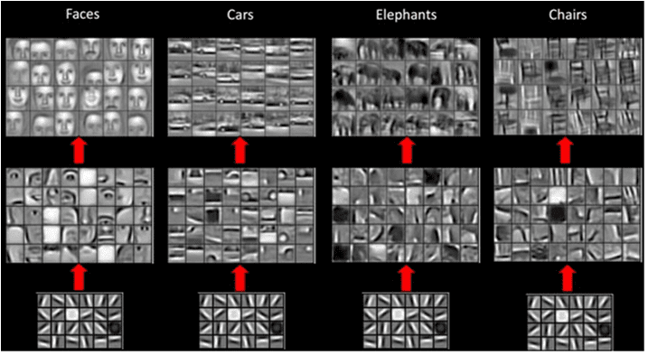

# Konvolutionella Neurala Nätverk

Vi har tidigare sett att neurala nätverk är ganska bra på att hantera bilder, och till och med ett enkelskiktat perceptron kan känna igen handskrivna siffror från MNIST-datasetet med rimlig noggrannhet. Men MNIST-datasetet är mycket speciellt, och alla siffror är centrerade i bilden, vilket gör uppgiften enklare.

## [Pre-lecture quiz](https://red-field-0a6ddfd03.1.azurestaticapps.net/quiz/107)

I verkliga livet vill vi kunna känna igen objekt på en bild oavsett deras exakta plats i bilden. Datorseende skiljer sig från generell klassificering, eftersom när vi försöker hitta ett visst objekt på bilden, skannar vi bilden för att leta efter specifika **mönster** och deras kombinationer. Till exempel, när vi letar efter en katt, kan vi först titta efter horisontella linjer, som kan bilda morrhår, och sedan kan en viss kombination av morrhår berätta för oss att det faktiskt är en bild av en katt. Relativ position och närvaro av vissa mönster är viktiga, och inte deras exakta position i bilden.

För att extrahera mönster kommer vi att använda begreppet **konvolutionella filter**. Som du vet representeras en bild av en 2D-matris, eller en 3D-tensor med färgdjup. Att applicera ett filter innebär att vi tar en relativt liten **filterkärna**-matris, och för varje pixel i den ursprungliga bilden beräknar vi det vägda genomsnittet med grannpunkter. Vi kan se detta som ett litet fönster som glider över hela bilden och genomsnittar alla pixlar enligt vikterna i filterkärnan.

 | 
----|----

> Bild av Dmitry Soshnikov

Till exempel, om vi applicerar 3x3 vertikala kant- och horisontella kantfilter på MNIST-siffrorna, kan vi få fram höjdpunkter (t.ex. höga värden) där det finns vertikala och horisontella kanter i vår ursprungliga bild. Så dessa två filter kan användas för att "leta efter" kanter. På samma sätt kan vi designa olika filter för att leta efter andra låg-nivå mönster:
Du är tränad på data fram till oktober 2023. 

> Bild av [Leung-Malik Filter Bank](https://www.robots.ox.ac.uk/~vgg/research/texclass/filters.html)

Men medan vi kan designa filter för att manuellt extrahera vissa mönster, kan vi också designa nätverket på ett sätt så att det lär sig mönstren automatiskt. Det är en av huvudidéerna bakom CNN.

## Huvudidéer bakom CNN

Sättet som CNN:er fungerar på baseras på följande viktiga idéer:

* Konvolutionella filter kan extrahera mönster
* Vi kan designa nätverket på ett sätt så att filter tränas automatiskt
* Vi kan använda samma metod för att hitta mönster i hög-nivå egenskaper, inte bara i den ursprungliga bilden. Således fungerar CNN:s funktionsutvinning på en hierarki av funktioner, som börjar från låg-nivå pixelkombinationer, upp till högre nivå kombinationer av bilddelar.

> Bild från [en artikel av Hislop-Lynch](https://www.semanticscholar.org/paper/Computer-vision-based-pedestrian-trajectory-Hislop-Lynch/26e6f74853fc9bbb7487b06dc2cf095d36c9021d), baserat på [deras forskning](https://dl.acm.org/doi/abs/10.1145/1553374.1553453)

## ✍️ Övningar: Konvolutionella Neurala Nätverk

Låt oss fortsätta utforska hur konvolutionella neurala nätverk fungerar, och hur vi kan uppnå träningsbara filter, genom att arbeta igenom de motsvarande anteckningarna:

* [Konvolutionella Neurala Nätverk - PyTorch](../../../../../lessons/4-ComputerVision/07-ConvNets/ConvNetsPyTorch.ipynb)
* [Konvolutionella Neurala Nätverk - TensorFlow](../../../../../lessons/4-ComputerVision/07-ConvNets/ConvNetsTF.ipynb)

## Pyramidarkitektur

De flesta CNN:er som används för bildbehandling följer en så kallad pyramidarkitektur. Det första konvolutionella lagret som tillämpas på de ursprungliga bilderna har vanligtvis ett relativt lågt antal filter (8-16), som motsvarar olika pixelkombinationer, såsom horisontella/vertikala linjer av streck. På nästa nivå minskar vi det spatiala dimensionerna av nätverket och ökar antalet filter, vilket motsvarar fler möjliga kombinationer av enkla egenskaper. Med varje lager, när vi rör oss mot den slutliga klassificeraren, minskar de spatiala dimensionerna av bilden, och antalet filter ökar.

Som ett exempel, låt oss titta på arkitekturen av VGG-16, ett nätverk som uppnådde 92,7% noggrannhet i ImageNets top-5 klassificering 2014:

> Bild från [Researchgate](https://www.researchgate.net/figure/Vgg16-model-structure-To-get-the-VGG-NIN-model-we-replace-the-2-nd-4-th-6-th-7-th_fig2_335194493)

## Bästa Kända CNN-arkitekturer

[Fortsätt din studie om de bäst kända CNN-arkitekturerna](CNN_Architectures.md)

**Ansvarsfriskrivning**:  
Detta dokument har översatts med hjälp av maskinbaserade AI-översättningstjänster. Även om vi strävar efter noggrannhet, vänligen var medveten om att automatiska översättningar kan innehålla fel eller oexaktheter. Det ursprungliga dokumentet på sitt modersmål bör betraktas som den auktoritativa källan. För kritisk information rekommenderas professionell mänsklig översättning. Vi ansvarar inte för eventuella missförstånd eller feltolkningar som uppstår från användningen av denna översättning.