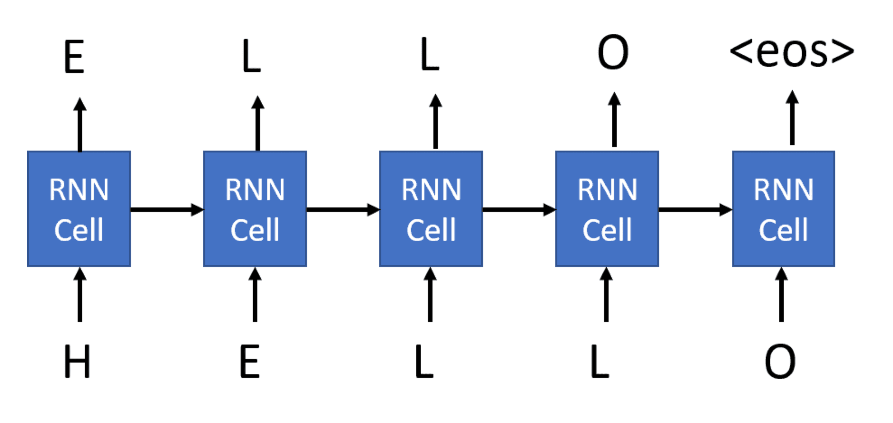

# Generativa nätverk

## [Förläsningsquiz](https://red-field-0a6ddfd03.1.azurestaticapps.net/quiz/117)

Återkommande neurala nätverk (RNNs) och deras varianter med gated celler, såsom Long Short Term Memory Cells (LSTMs) och Gated Recurrent Units (GRUs), erbjuder en mekanism för språkmodellering genom att de kan lära sig ordningsföljd och ge förutsägelser för nästa ord i en sekvens. Detta gör att vi kan använda RNNs för **generativa uppgifter**, som vanlig textgenerering, maskinöversättning och till och med bildbeskrivning.

> ✅ Tänk på alla gånger du har haft nytta av generativa uppgifter som textkomplettering medan du skriver. Gör lite forskning om dina favoritapplikationer för att se om de utnyttjar RNNs.

I RNN-arkitekturen vi diskuterade i den föregående enheten, producerade varje RNN-enhet nästa dolda tillstånd som en utdata. Vi kan dock också lägga till en annan utdata till varje återkommande enhet, vilket skulle tillåta oss att producera en **sekvens** (som är lika lång som den ursprungliga sekvensen). Dessutom kan vi använda RNN-enheter som inte tar emot en ingång vid varje steg, utan istället tar en initial tillståndsvektor och sedan producerar en sekvens av utdata.

Detta möjliggör olika neurala arkitekturer som visas i bilden nedan:


> Bild från blogginlägget [Unreasonable Effectiveness of Recurrent Neural Networks](http://karpathy.github.io/2015/05/21/rnn-effectiveness/) av [Andrej Karpaty](http://karpathy.github.io/)

* **En-till-en** är ett traditionellt neuralt nätverk med en ingång och en utgång
* **En-till-många** är en generativ arkitektur som accepterar ett ingångsvärde och genererar en sekvens av utgångsvärden. Till exempel, om vi vill träna ett **bildbeskrivnings** nätverk som skulle producera en textuell beskrivning av en bild, kan vi använda en bild som ingång, skicka den genom en CNN för att få dess dolda tillstånd, och sedan låta en återkommande kedja generera beskrivningen ord för ord
* **Många-till-en** motsvarar de RNN-arkitekturer vi beskrev i den föregående enheten, såsom textklassificering
* **Många-till-många**, eller **sekvens-till-sekvens** motsvarar uppgifter som **maskinöversättning**, där vi först har en RNN som samlar all information från ingångssekvensen till det dolda tillståndet, och en annan RNN-kedja utvecklar detta tillstånd till utgångssekvensen.

I denna enhet kommer vi att fokusera på enkla generativa modeller som hjälper oss att generera text. För enkelhetens skull kommer vi att använda tecken-nivå tokenisering.

Vi kommer att träna denna RNN för att generera text steg för steg. Vid varje steg kommer vi att ta en sekvens av tecken av längd `nchars`, och be nätverket att generera nästa utdata-tecken för varje ingångstecken:



När vi genererar text (under inferens), börjar vi med en viss **prompt**, som skickas genom RNN-celler för att generera sitt mellanliggande tillstånd, och sedan börjar generationen från detta tillstånd. Vi genererar ett tecken i taget och skickar tillståndet och det genererade tecknet till en annan RNN-cell för att generera nästa, tills vi har genererat tillräckligt med tecken.


> Bild av författaren

## ✍️ Övningar: Generativa Nätverk

Fortsätt din inlärning i följande anteckningsblock:

* [Generativa Nätverk med PyTorch](../../../../../lessons/5-NLP/17-GenerativeNetworks/GenerativePyTorch.ipynb)
* [Generativa Nätverk med TensorFlow](../../../../../lessons/5-NLP/17-GenerativeNetworks/GenerativeTF.ipynb)

## Mjuk textgenerering och temperatur

Utdata från varje RNN-cell är en sannolikhetsfördelning av tecken. Om vi alltid tar tecknet med den högsta sannolikheten som nästa tecken i den genererade texten, kan texten ofta bli "cyklad" mellan samma teckensekvenser om och om igen, som i detta exempel:

```
today of the second the company and a second the company ...
```

Men om vi tittar på sannolikhetsfördelningen för nästa tecken, kan det hända att skillnaden mellan några av de högsta sannolikheterna inte är stor, t.ex. ett tecken kan ha sannolikheten 0.2, ett annat - 0.19, osv. Till exempel, när vi letar efter nästa tecken i sekvensen '*play*', kan nästa tecken lika gärna vara antingen ett mellanslag eller **e** (som i ordet *player*).

Detta leder oss till slutsatsen att det inte alltid är "rättvist" att välja tecknet med högre sannolikhet, eftersom valet av det näst högsta fortfarande kan leda oss till meningsfull text. Det är klokare att **prova** tecken från sannolikhetsfördelningen som ges av nätverksutdata. Vi kan också använda en parameter, **temperatur**, som kommer att platta ut sannolikhetsfördelningen, om vi vill lägga till mer slumpmässighet, eller göra den brantare, om vi vill hålla oss mer till tecknen med högsta sannolikhet.

Utforska hur denna mjuka textgenerering implementeras i anteckningsblocken länkade ovan.

## Slutsats

Även om textgenerering kan vara användbar i sig, kommer de största fördelarna från förmågan att generera text med hjälp av RNNs från en viss initial funktionsvektor. Till exempel används textgenerering som en del av maskinöversättning (sekvens-till-sekvens, i detta fall används tillståndsvektorn från *encoder* för att generera eller *avkoda* det översatta meddelandet), eller för att generera en textuell beskrivning av en bild (i vilket fall funktionsvektorn skulle komma från CNN-extraktorn).

## 🚀 Utmaning

Ta några lektioner på Microsoft Learn om detta ämne

* Textgenerering med [PyTorch](https://docs.microsoft.com/learn/modules/intro-natural-language-processing-pytorch/6-generative-networks/?WT.mc_id=academic-77998-cacaste)/[TensorFlow](https://docs.microsoft.com/learn/modules/intro-natural-language-processing-tensorflow/5-generative-networks/?WT.mc_id=academic-77998-cacaste)

## [Efterläsningsquiz](https://red-field-0a6ddfd03.1.azurestaticapps.net/quiz/217)

## Granskning & Självstudie

Här är några artiklar för att utöka din kunskap

* Olika tillvägagångssätt för textgenerering med Markov Chain, LSTM och GPT-2: [blogginlägg](https://towardsdatascience.com/text-generation-gpt-2-lstm-markov-chain-9ea371820e1e)
* Exempel på textgenerering i [Keras-dokumentationen](https://keras.io/examples/generative/lstm_character_level_text_generation/)

## [Uppgift](lab/README.md)

Vi har sett hur man genererar text tecken för tecken. I labbet kommer du att utforska textgenerering på ordnivå.

**Ansvarsfriskrivning**:  
Detta dokument har översatts med hjälp av maskinbaserade AI-översättningstjänster. Även om vi strävar efter noggrannhet, vänligen var medveten om att automatiska översättningar kan innehålla fel eller oegentligheter. Det ursprungliga dokumentet på sitt modersmål bör betraktas som den auktoritativa källan. För kritisk information rekommenderas professionell mänsklig översättning. Vi ansvarar inte för några missförstånd eller felaktiga tolkningar som uppstår till följd av användningen av denna översättning.