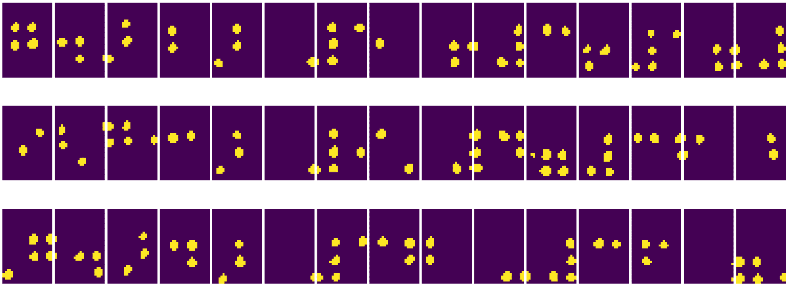

# 计算机视觉简介

[计算机视觉](https://wikipedia.org/wiki/Computer_vision) 是一门旨在使计算机能够高水平理解数字图像的学科。这是一个相当广泛的定义，因为“理解”可以有许多不同的含义，包括在图片中找到物体（**物体检测**）、理解发生了什么（**事件检测**）、用文本描述一幅图像，或重建3D场景。还有一些与人类图像相关的特殊任务：年龄和情感估计、面部检测和识别，以及3D姿态估计等。

## [课前测验](https://red-field-0a6ddfd03.1.azurestaticapps.net/quiz/106)

计算机视觉最简单的任务之一是 **图像分类**。

计算机视觉通常被视为人工智能的一个分支。如今，大多数计算机视觉任务都是通过神经网络解决的。在本节中，我们将深入了解用于计算机视觉的特殊类型神经网络——[卷积神经网络](../07-ConvNets/README.md)。

然而，在将图像传递给神经网络之前，在许多情况下，使用一些算法技术来增强图像是有意义的。

有几种可用于图像处理的Python库：

* **[imageio](https://imageio.readthedocs.io/en/stable/)** 可用于读取/写入不同的图像格式。它还支持ffmpeg，这是一个将视频帧转换为图像的有用工具。
* **[Pillow](https://pillow.readthedocs.io/en/stable/index.html)**（也称为PIL）功能更强大，还支持一些图像处理，例如形态变化、调色板调整等。
* **[OpenCV](https://opencv.org/)** 是一个用C++编写的强大图像处理库，已成为图像处理的*事实*标准。它有一个方便的Python接口。
* **[dlib](http://dlib.net/)** 是一个C++库，实现了许多机器学习算法，包括一些计算机视觉算法。它也有Python接口，可以用于面部和面部特征点检测等挑战性任务。

## OpenCV

[OpenCV](https://opencv.org/) 被认为是图像处理的*事实*标准。它包含许多有用的算法，都是用C++实现的。您也可以通过Python调用OpenCV。

学习OpenCV的好地方是[这个学习OpenCV的课程](https://learnopencv.com/getting-started-with-opencv/)。在我们的课程中，我们的目标不是学习OpenCV，而是向您展示一些可以使用它的示例，以及如何使用。

### 加载图像

在Python中，图像可以方便地表示为NumPy数组。例如，320x200像素的灰度图像将存储在一个200x320的数组中，而同一尺寸的彩色图像的形状将为200x320x3（代表3个颜色通道）。要加载图像，可以使用以下代码：

```python
import cv2
import matplotlib.pyplot as plt

im = cv2.imread('image.jpeg')
plt.imshow(im)
```

传统上，OpenCV使用BGR（蓝-绿-红）编码彩色图像，而Python的其他工具使用更传统的RGB（红-绿-蓝）。为了使图像看起来正确，您需要将其转换为RGB颜色空间，可以通过交换NumPy数组中的维度或调用OpenCV函数来实现：

```python
im = cv2.cvtColor(im,cv2.COLOR_BGR2RGB)
```

相同的 `cvtColor` function can be used to perform other color space transformations such as converting an image to grayscale or to the HSV (Hue-Saturation-Value) color space.

You can also use OpenCV to load video frame-by-frame - an example is given in the exercise [OpenCV Notebook](../../../../../lessons/4-ComputerVision/06-IntroCV/OpenCV.ipynb).

### Image Processing

Before feeding an image to a neural network, you may want to apply several pre-processing steps. OpenCV can do many things, including:

* **Resizing** the image using `im = cv2.resize(im, (320,200),interpolation=cv2.INTER_LANCZOS)`
* **Blurring** the image using `im = cv2.medianBlur(im,3)` or `im = cv2.GaussianBlur(im, (3,3), 0)`
* Changing the **brightness and contrast** of the image can be done by NumPy array manipulations, as described [in this Stackoverflow note](https://stackoverflow.com/questions/39308030/how-do-i-increase-the-contrast-of-an-image-in-python-opencv).
* Using [thresholding](https://docs.opencv.org/4.x/d7/d4d/tutorial_py_thresholding.html) by calling `cv2.threshold`/`cv2.adaptiveThreshold` 函数，通常比调整亮度或对比度更可取。
* 对图像应用不同的 [变换](https://docs.opencv.org/4.5.5/da/d6e/tutorial_py_geometric_transformations.html)：
    - **[仿射变换](https://docs.opencv.org/4.5.5/d4/d61/tutorial_warp_affine.html)** 如果您需要将旋转、调整大小和倾斜结合到图像中，并且知道图像中三点的源和目标位置，这将非常有用。仿射变换保持平行线平行。
    - **[透视变换](https://medium.com/analytics-vidhya/opencv-perspective-transformation-9edffefb2143)** 当您知道图像中4个点的源和目标位置时，可以非常有用。例如，如果您通过智能手机相机从某个角度拍摄一张矩形文档的照片，并希望制作该文档的矩形图像。
* 通过使用 **[光流](https://docs.opencv.org/4.5.5/d4/dee/tutorial_optical_flow.html)** 理解图像内部的运动。

## 计算机视觉使用示例

在我们的 [OpenCV笔记本](../../../../../lessons/4-ComputerVision/06-IntroCV/OpenCV.ipynb) 中，我们提供了一些计算机视觉可以用于执行特定任务的示例：

* **对盲文书籍的照片进行预处理**。我们重点介绍如何使用阈值处理、特征检测、透视变换和NumPy操作来分离单个盲文符号，以便通过神经网络进行进一步分类。

 |  | 
----|-----|-----

> 图片来自 [OpenCV.ipynb](../../../../../lessons/4-ComputerVision/06-IntroCV/OpenCV.ipynb)

* **使用帧差检测视频中的运动**。如果相机固定，则来自相机的帧应该彼此非常相似。由于帧被表示为数组，因此通过减去两个后续帧的数组，我们将得到像素差异，对于静态帧来说，这个差异应该很低，而一旦图像中出现实质性运动，差异就会增大。


> 图片来自 [OpenCV.ipynb](../../../../../lessons/4-ComputerVision/06-IntroCV/OpenCV.ipynb)

* **使用光流检测运动**。 [光流](https://docs.opencv.org/3.4/d4/dee/tutorial_optical_flow.html) 使我们能够理解视频帧上单个像素的运动。光流有两种类型：

   - **稠密光流** 计算向量场，显示每个像素的运动方向
   - **稀疏光流** 基于提取图像中的一些独特特征（例如边缘），并从帧到帧构建其轨迹。


> 图片来自 [OpenCV.ipynb](../../../../../lessons/4-ComputerVision/06-IntroCV/OpenCV.ipynb)

## ✍️ 示例笔记本：OpenCV [在行动中尝试OpenCV](../../../../../lessons/4-ComputerVision/06-IntroCV/OpenCV.ipynb)

让我们通过探索 [OpenCV笔记本](../../../../../lessons/4-ComputerVision/06-IntroCV/OpenCV.ipynb) 来进行一些OpenCV实验。

## 结论

有时，相对复杂的任务，如运动检测或指尖检测，可以仅通过计算机视觉来解决。因此，了解计算机视觉的基本技术以及像OpenCV这样的库能做什么是非常有帮助的。

## 🚀 挑战

观看 [这个视频](https://docs.microsoft.com/shows/ai-show/ai-show--2021-opencv-ai-competition--grand-prize-winners--cortic-tigers--episode-32?WT.mc_id=academic-77998-cacaste) 来了解Cortic Tigers项目，以及他们如何通过机器人构建基于区块的解决方案，以使计算机视觉任务民主化。研究其他类似的项目，帮助新学习者进入这个领域。

## [课后测验](https://red-field-0a6ddfd03.1.azurestaticapps.net/quiz/206)

## 复习与自学

在[这个精彩的教程](https://learnopencv.com/optical-flow-in-opencv/)中阅读更多关于光流的内容。

## [作业](lab/README.md)

在这个实验中，您将拍摄一个简单手势的视频，您的目标是使用光流提取上下左右的运动。


**免责声明**：  
本文件使用基于机器的人工智能翻译服务进行翻译。虽然我们努力确保准确性，但请注意，自动翻译可能包含错误或不准确之处。原文以其母语应被视为权威来源。对于关键信息，建议进行专业人工翻译。我们对因使用本翻译而产生的任何误解或误释不承担责任。