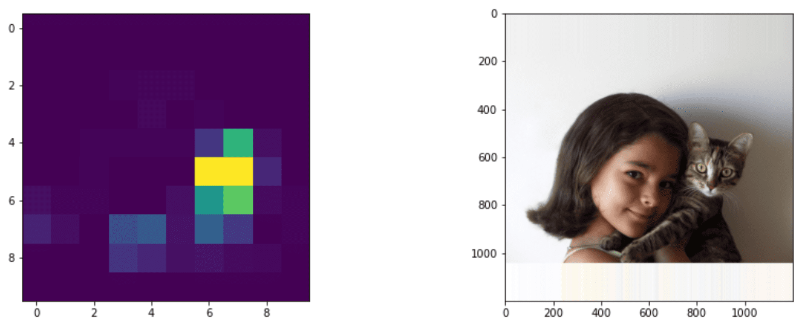
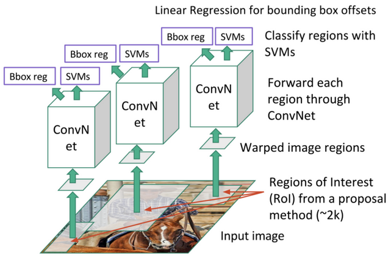
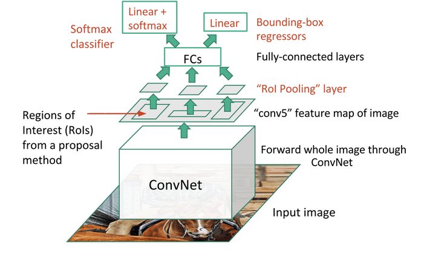
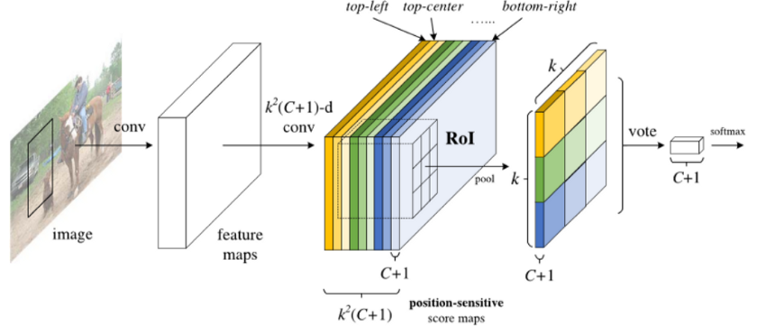

### 物体检测

到目前为止，我们处理的图像分类模型接收一张图像并生成一个分类结果，例如在 MNIST 问题中的 'number' 类别。然而，在许多情况下，我们不仅想知道一张图片描绘了哪些物体 - 我们希望能够确定它们的精确位置。这正是 **物体检测** 的意义所在。

## [课前测验](https://red-field-0a6ddfd03.1.azurestaticapps.net/quiz/111)

> 图片来自 [YOLO v2 网站](https://pjreddie.com/darknet/yolov2/)

## 一种简单的物体检测方法

假设我们想在一张图片中找到一只猫，一种非常简单的物体检测方法如下：

1. 将图片分解为多个瓦片
2. 对每个瓦片进行图像分类。
3. 结果激活值足够高的瓦片可以认为包含了所需的物体。

> *图片来自 [练习笔记本](../../../../../lessons/4-ComputerVision/11-ObjectDetection/ObjectDetection-TF.ipynb)*

然而，这种方法远非理想，因为它只能让算法非常不精确地定位物体的边界框。为了更精确地定位，我们需要运行某种 **回归** 来预测边界框的坐标 - 为此，我们需要特定的数据集。

## 物体检测的回归

[这篇博客文章](https://towardsdatascience.com/object-detection-with-neural-networks-a4e2c46b4491)对检测形状有很好的入门介绍。

## 物体检测的数据集

您可能会遇到以下数据集用于此任务：

* [PASCAL VOC](http://host.robots.ox.ac.uk/pascal/VOC/) - 20 个类别
* [COCO](http://cocodataset.org/#home) - 上下文中的常见物体。80 个类别，边界框和分割掩码

## 物体检测指标

### 交并比

虽然对于图像分类来说，衡量算法性能是简单的，但对于物体检测，我们需要同时衡量类别的正确性以及推断的边界框位置的精确度。对于后者，我们使用所谓的 **交并比** (IoU)，它衡量两个框（或两个任意区域）重叠的程度。

> *图2来自 [这篇关于 IoU 的优秀博客文章](https://pyimagesearch.com/2016/11/07/intersection-over-union-iou-for-object-detection/)*

这个概念很简单 - 我们将两个图形之间的交集面积除以它们的并集面积。对于两个相同的区域，IoU 将为 1，而对于完全不相交的区域，IoU 将为 0。否则，它将介于 0 和 1 之间。我们通常只考虑那些 IoU 超过某个值的边界框。

### 平均精度

假设我们想衡量给定物体类别 $C$ 的识别效果。为了进行测量，我们使用 **平均精度** 指标，其计算方法如下：

1. 考虑精度-召回曲线，显示准确度取决于检测阈值（从 0 到 1）。
2. 根据阈值，我们将检测到的物体数量有所不同，精度和召回值也会不同。
3. 曲线将呈现如下形状：

> *图片来自 [NeuroWorkshop](http://github.com/shwars/NeuroWorkshop)*

给定类别 $C$ 的平均精度是该曲线下的面积。更准确地说，召回轴通常被分为 10 个部分，精度在所有这些点上进行平均：

$$
AP = {1\over11}\sum_{i=0}^{10}\mbox{Precision}(\mbox{Recall}={i\over10})
$$

### AP 和 IoU

我们只考虑那些 IoU 超过某个值的检测。例如，在 PASCAL VOC 数据集中，通常假设 $\mbox{IoU Threshold} = 0.5$，而在 COCO 中，AP 是针对不同的 $\mbox{IoU Threshold}$ 值进行测量的。

> *图片来自 [NeuroWorkshop](http://github.com/shwars/NeuroWorkshop)*

### 平均平均精度 - mAP

物体检测的主要指标称为 **平均平均精度**，或 **mAP**。它是所有物体类别的平均精度的值，有时也会在 $\mbox{IoU Threshold}$ 上进行平均。更详细地说，计算 **mAP** 的过程在 [这篇博客文章](https://medium.com/@timothycarlen/understanding-the-map-evaluation-metric-for-object-detection-a07fe6962cf3) 中有描述，此外 [这里还有代码示例](https://gist.github.com/tarlen5/008809c3decf19313de216b9208f3734)。

## 不同的物体检测方法

物体检测算法大致分为两类：

* **区域提议网络** (R-CNN, Fast R-CNN, Faster R-CNN)。其主要思想是生成 **兴趣区域** (ROI)，并在其上运行 CNN，寻找最大激活。它有点类似于简单的方法，唯一的区别是 ROI 是以更聪明的方式生成的。这种方法的一个主要缺点是速度较慢，因为我们需要对图像进行多次 CNN 分类器的传递。
* **一次性** (YOLO, SSD, RetinaNet) 方法。在这些架构中，我们设计网络以在一次传递中同时预测类别和 ROI。

### R-CNN：基于区域的 CNN

[R-CNN](http://islab.ulsan.ac.kr/files/announcement/513/rcnn_pami.pdf) 使用 [选择性搜索](http://www.huppelen.nl/publications/selectiveSearchDraft.pdf) 生成 ROI 区域的层次结构，这些区域随后通过 CNN 特征提取器和 SVM 分类器进行处理，以确定物体类别，并通过线性回归确定 *边界框* 坐标。[官方论文](https://arxiv.org/pdf/1506.01497v1.pdf)

> *图片来自 van de Sande 等人 ICCV’11*

> *图片来自 [这篇博客](https://towardsdatascience.com/r-cnn-fast-r-cnn-faster-r-cnn-yolo-object-detection-algorithms-36d53571365e)*

### F-RCNN - 快速 R-CNN

这种方法类似于 R-CNN，但在应用卷积层之后定义区域。

> 图片来自 [官方论文](https://www.cv-foundation.org/openaccess/content_iccv_2015/papers/Girshick_Fast_R-CNN_ICCV_2015_paper.pdf)，[arXiv](https://arxiv.org/pdf/1504.08083.pdf)，2015

### Faster R-CNN

这种方法的主要思想是使用神经网络来预测 ROI - 所谓的 *区域提议网络*。[论文](https://arxiv.org/pdf/1506.01497.pdf)，2016

> 图片来自 [官方论文](https://arxiv.org/pdf/1506.01497.pdf)

### R-FCN：基于区域的全卷积网络

该算法比 Faster R-CNN 更快。其主要思想如下：

1. 使用 ResNet-101 提取特征
1. 特征通过 **位置敏感得分图** 进行处理。每个 $C$ 类别的物体被划分为 $k\times k$ 区域，我们训练以预测物体的部分。
1. 对于每个 $k\times k$ 区域，所有网络对物体类别进行投票，选择得票最多的物体类别。

> 图片来自 [官方论文](https://arxiv.org/abs/1605.06409)

### YOLO - 你只看一次

YOLO 是一种实时的一次性算法。其主要思想如下：

 * 将图像划分为 $S\times S$ 区域
 * 对于每个区域，**CNN** 预测 $n$ 个可能的物体、*边界框* 坐标和 *置信度*=*概率* * IoU。

 
> 图片来自 [官方论文](https://arxiv.org/abs/1506.02640)

### 其他算法

* RetinaNet: [官方论文](https://arxiv.org/abs/1708.02002)
   - [PyTorch 在 Torchvision 中的实现](https://pytorch.org/vision/stable/_modules/torchvision/models/detection/retinanet.html)
   - [Keras 实现](https://github.com/fizyr/keras-retinanet)
   - [使用 RetinaNet 的目标检测](https://keras.io/examples/vision/retinanet/) 在 Keras 示例中
* SSD（单次检测器）: [官方论文](https://arxiv.org/abs/1512.02325)

## ✍️ 练习：目标检测

在以下笔记本中继续学习：

[ObjectDetection.ipynb](../../../../../lessons/4-ComputerVision/11-ObjectDetection/ObjectDetection.ipynb)

## 结论

在本节课中，你快速浏览了实现目标检测的各种方法！

## 🚀 挑战

阅读这些关于 YOLO 的文章和笔记本，并亲自尝试

* [一篇好的博客文章](https://www.analyticsvidhya.com/blog/2018/12/practical-guide-object-detection-yolo-framewor-python/) 描述了 YOLO
 * [官方网站](https://pjreddie.com/darknet/yolo/)
 * Yolo: [Keras 实现](https://github.com/experiencor/keras-yolo2)，[逐步笔记本](https://github.com/experiencor/basic-yolo-keras/blob/master/Yolo%20Step-by-Step.ipynb)
 * Yolo v2: [Keras 实现](https://github.com/experiencor/keras-yolo2)，[逐步笔记本](https://github.com/experiencor/keras-yolo2/blob/master/Yolo%20Step-by-Step.ipynb)

## [课后测验](https://red-field-0a6ddfd03.1.azurestaticapps.net/quiz/211)

## 复习与自学

* [目标检测](https://tjmachinelearning.com/lectures/1718/obj/) 由 Nikhil Sardana 撰写
* [目标检测算法的良好比较](https://lilianweng.github.io/lil-log/2018/12/27/object-detection-part-4.html)
* [深度学习算法在目标检测中的回顾](https://medium.com/comet-app/review-of-deep-learning-algorithms-for-object-detection-c1f3d437b852)
* [基本目标检测算法的逐步介绍](https://www.analyticsvidhya.com/blog/2018/10/a-step-by-step-introduction-to-the-basic-object-detection-algorithms-part-1/)
* [在 Python 中实现 Faster R-CNN 进行目标检测](https://www.analyticsvidhya.com/blog/2018/11/implementation-faster-r-cnn-python-object-detection/)

## [作业：目标检测](lab/README.md)

**免责声明**：  
本文件是使用机器翻译服务进行翻译的。虽然我们努力追求准确性，但请注意，自动翻译可能包含错误或不准确之处。原始文件的母语版本应被视为权威来源。对于关键信息，建议使用专业人工翻译。我们对因使用本翻译而产生的任何误解或错误解读不承担任何责任。