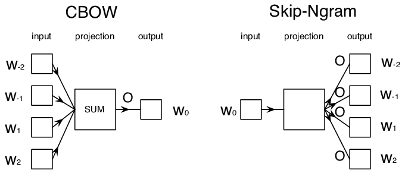

# 嵌入

## [课前测验](https://red-field-0a6ddfd03.1.azurestaticapps.net/quiz/114)

在基于 BoW 或 TF/IDF 训练分类器时，我们操作的是长度为 `vocab_size` 的高维词袋向量，并且我们明确地将低维位置表示向量转换为稀疏的一热编码表示。然而，这种一热编码表示并不高效。此外，每个单词是独立处理的，即一热编码向量并不表达单词之间的任何语义相似性。

**嵌入** 的理念是用低维稠密向量来表示单词，这些向量在某种程度上反映了单词的语义含义。我们稍后将讨论如何构建有意义的词嵌入，但现在我们可以将嵌入视为一种降低词向量维度的方法。

因此，嵌入层将一个单词作为输入，并生成指定长度 `embedding_size` 的输出向量。从某种意义上说，它与 `Linear` 层非常相似，但它不是接受一热编码向量，而是能够接受单词编号作为输入，从而避免创建大型一热编码向量。

通过将嵌入层作为分类器网络的第一层，我们可以从词袋模型切换到 **嵌入袋** 模型，在这种模型中，我们首先将文本中的每个单词转换为相应的嵌入，然后计算这些嵌入的某种聚合函数，例如 `sum`、`average` 或 `max`。

> 图片由作者提供

## ✍️ 练习：嵌入

在以下笔记本中继续学习：
* [使用 PyTorch 的嵌入](../../../../../lessons/5-NLP/14-Embeddings/EmbeddingsPyTorch.ipynb)
* [使用 TensorFlow 的嵌入](../../../../../lessons/5-NLP/14-Embeddings/EmbeddingsTF.ipynb)

## 语义嵌入：Word2Vec

虽然嵌入层学会了将单词映射到向量表示，但这种表示不一定具有太多的语义意义。能够学习到一种向量表示，使得相似的单词或同义词对应的向量在某种向量距离（例如欧几里得距离）上是接近的，这将是非常有益的。

为此，我们需要以特定方式在大量文本上预训练我们的嵌入模型。一种训练语义嵌入的方法称为 [Word2Vec](https://en.wikipedia.org/wiki/Word2vec)。它基于两种主要架构，用于生成单词的分布式表示：

 - **连续词袋模型**（CBoW）——在这种架构中，我们训练模型从周围的上下文中预测一个单词。给定 ngram $(W_{-2},W_{-1},W_0,W_1,W_2)$，模型的目标是从 $(W_{-2},W_{-1},W_1,W_2)$ 预测 $W_0$。
 - **连续跳字模型**与 CBoW 相反。模型使用上下文单词的周围窗口来预测当前单词。

CBoW 速度更快，而跳字模型速度较慢，但在表示不常见单词方面表现更好。

> 图片来自 [这篇论文](https://arxiv.org/pdf/1301.3781.pdf)

Word2Vec 预训练的嵌入（以及其他类似模型，如 GloVe）也可以替代神经网络中的嵌入层。然而，我们需要处理词汇表，因为用于预训练 Word2Vec/GloVe 的词汇表可能与我们的文本语料库中的词汇表不同。请查看上述笔记本，了解如何解决这个问题。

## 上下文嵌入

传统的预训练嵌入表示（如 Word2Vec）的一个关键限制是单词意义消歧的问题。虽然预训练的嵌入可以捕捉单词在上下文中的某些含义，但单词的每种可能含义都被编码到同一个嵌入中。这可能会在下游模型中引发问题，因为许多单词（例如“play”这个词）根据上下文的不同有不同的含义。

例如，单词“play”在这两个不同的句子中有着截然不同的意思：

- 我去剧院看了一场 **戏**。
- 约翰想和他的朋友们 **玩**。

上述预训练的嵌入在同一个嵌入中表示了“play”这个词的这两种含义。为了克服这个限制，我们需要基于 **语言模型** 构建嵌入，该模型是在大量文本语料库上训练的，并且*知道*单词如何在不同上下文中组合。讨论上下文嵌入超出了本教程的范围，但我们将在后面的课程中讨论语言模型时再回到这个话题。

## 结论

在本课中，您了解到如何在 TensorFlow 和 Pytorch 中构建和使用嵌入层，以更好地反映单词的语义含义。

## 🚀 挑战

Word2Vec 已被用于一些有趣的应用，包括生成歌词和诗歌。请查看 [这篇文章](https://www.politetype.com/blog/word2vec-color-poems)，了解作者如何使用 Word2Vec 生成诗歌。观看 [Dan Shiffmann 的这段视频](https://www.youtube.com/watch?v=LSS_bos_TPI&ab_channel=TheCodingTrain)，以发现对这种技术的不同解释。然后尝试将这些技术应用于您自己的文本语料库，也许可以从 Kaggle 获取数据。

## [课后测验](https://red-field-0a6ddfd03.1.azurestaticapps.net/quiz/214)

## 复习与自学

阅读这篇关于 Word2Vec 的论文：[高效估计向量空间中的单词表示](https://arxiv.org/pdf/1301.3781.pdf)

## [作业：笔记本](assignment.md)

**免责声明**：
本文件是使用基于机器的人工智能翻译服务进行翻译的。虽然我们努力追求准确性，但请注意，自动翻译可能包含错误或不准确之处。原始文件的母语版本应被视为权威来源。对于关键信息，建议进行专业人工翻译。我们对因使用本翻译而产生的任何误解或误释不承担责任。